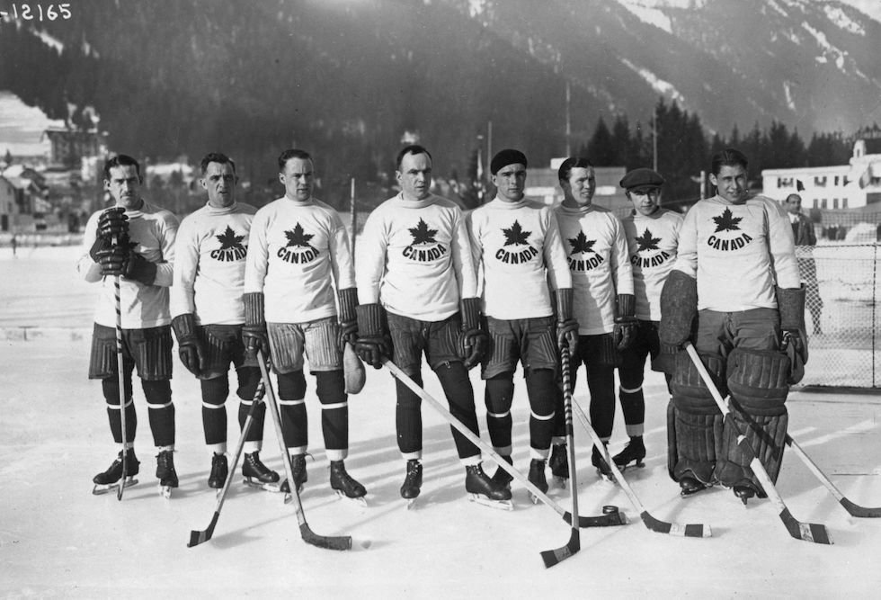
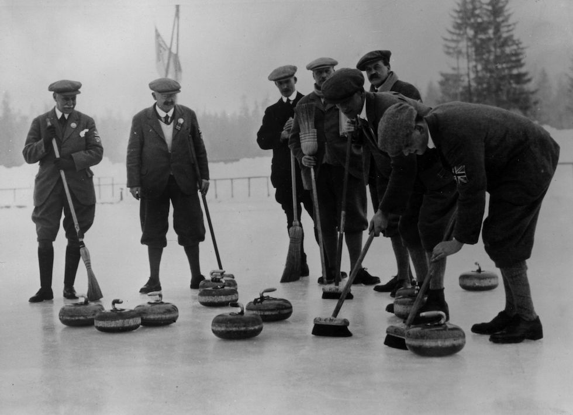
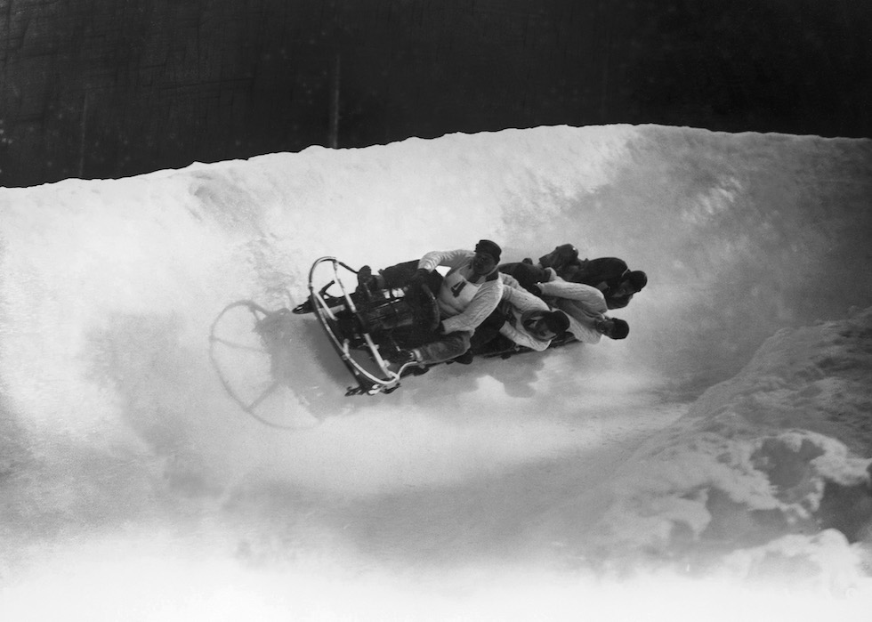

# I. Chamonix-Mont-Blanc 1924 {-}

```{r, echo=FALSE, out.width='40%', fig.cap='I edizione dei Giochi olimpici invernali'}
knitr::include_graphics("images/loghi/1924.jpg")
```

Si disputa in Francia come "Settimana internazionale degli sport invernali" sotto il patrocinio del CIO, che nel 1925 la riconosce come prima edizione dei Giochi olimpici invernali.

Dati:

* 16 nazioni
* 258 atleti
* 6 discipline:
  * combinata nordica
  * bob 
  * curling (dimostrativo)
  * hockey su ghiaccio
  * sci
  * pattinaggio
  
```{r, echo=FALSE, out.width='80%', fig.cap='La Nazionale canadese di hockey a Chamonix nel 1924 per la prima edizione delle Olimpiadi invernali. (Topical Press Agency/Getty Images)'}

```

```{r, echo=FALSE, out.width='80%', fig.cap='La squadra inglese di curling a Chamonix nel 1924 per la prima edizione delle Olimpiadi invernali. (Topical Press Agency/Getty Images)'}

```

```{r, echo=FALSE, out.width='80%', fig.cap='La squadra di bob inglese durante il torneo olimpico di Chamonix nel 1924. (Topical Press Agency/Hulton Archive/Getty Images)'}

```
