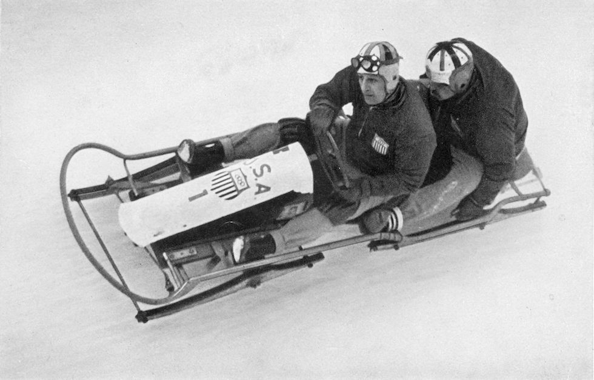

# IV. Garmish-Partenkirchen 1936 {-}

```{r, echo=FALSE, out.width='40%', fig.cap='IV edizione dei Giochi olimpici invernali'}
knitr::include_graphics("images/loghi/1936.jpg")
```

Si svolgono in Germania.

Dati:

* 28 nazioni
* 646 atleti
* 8 specialità:
  * bob
  * hockey
  * pattinaggio di figura
  * pattinaggio di velocità
  * sci alpino
  * combinata nordica
  * salto con gli sci
  * sci di fondo

```{r, echo=FALSE, out.width='80%', fig.cap='Ivan Brown e Alan Washbond in una prova del bob maschile alle Olimpiadi di Garmisch-Partenkirchen del 1936. (Hulton Archive/Getty Images)'}

```
