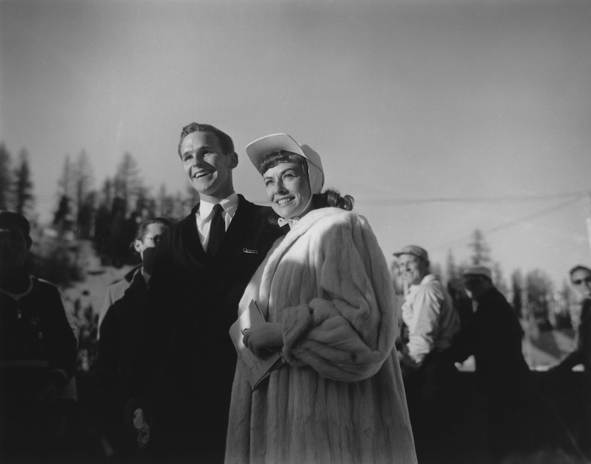

# V. Sankt Moritz 1948 {-}

```{r, echo=FALSE, out.width='40%', fig.cap='V edizione dei Giochi olimpici invernali'}
knitr::include_graphics("images/loghi/1948.png")
```

Si svolgono in Svizzera.

Dati:

* 28 nazioni
* 669 atleti
* 9 specialità:
  * bob
  * hockey
  * pattinaggio di figura
  * pattinaggio di velocità
  * sci alpino
  * combinata nordica
  * salto con gli sci
  * sci di fondo
  * skeleton

```{r, echo=FALSE, out.width='80%', fig.cap="Il pattinatore artistico americano Dick Button con l'attrice Paulette Goddard alle Olimpiadi invernali di Sankt Moritz, nel 1948. (Allsport Hulton/Archive)"}

```

## Interruzione Seconda Guerra Mondiale {-}

L'edizione dei V Giochi olimpici invernali si sarebbe dovuta svolgere a Sapporo in Giappone nel febbraio del 1940.

La città giapponese venne scelta come organizzatrice dei Giochi il 9 giugno 1937. In seguito allo scoppio della Seconda guerra sino-giapponese, l'organizzazione venne riassegnata il 15 luglio 1938 a Sankt Moritz, che aveva già ospitato i II Giochi olimpici invernali.

In seguito a controversie sorte fra il comitato organizzatore svizzero ed il CIO, quest'ultimo decise per la seconda volta di riassegnare i Giochi il 9 giugno 1939: la scelta cadde su Garmisch, che aveva ospitato l'ultima edizione dei Giochi e che li avrebbe dunque organizzati di nuovo.

Lo scoppio della seconda guerra mondiale portò infine all'annullamento definitivo dei Giochi nel novembre del 1939.

Allo stesso modo venne annulata l'edizione del 1944 che avrebbe dovuto svolgersi a Cortina d'Ampezzo.
