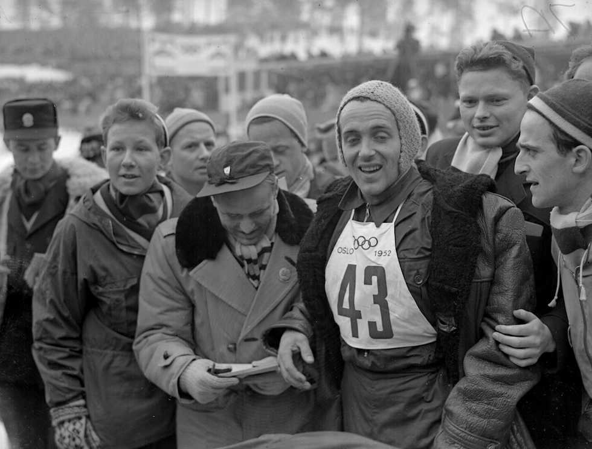
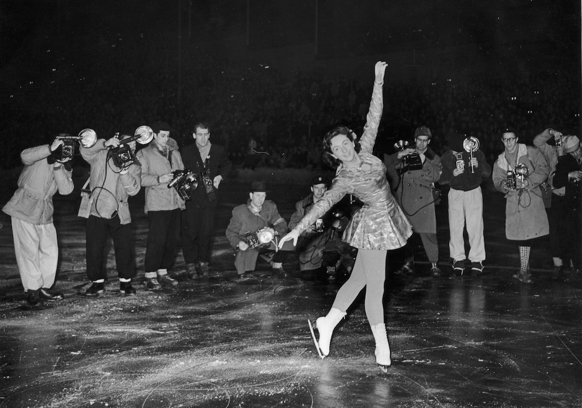

# VI. Oslo 1952 {-}

```{r, echo=FALSE, out.width='40%', fig.cap='VI edizione dei Giochi olimpici invernali'}
knitr::include_graphics("images/loghi/1952.png")
```

Si svolgono in Norvegia.

Dati:

* 30 nazioni
* 694 atleti
* 8 specialità:
  * bob
  * hockey
  * pattinaggio di figura
  * pattinaggio di velocità
  * sci alpino
  * salto con gli sci
  * sci di fondo
  * combinata nordica
  
```{r, echo=FALSE, out.width='80%', fig.cap='Il norvegese Brenden Hallgeir dopo aver vinto la prova di sci di fondo alle Olimpiadi di Oslo del 1952. (Allsport Hulton/Archive)'}

```

```{r, echo=FALSE, out.width='80%', fig.cap="L'inglese Jeannette Altwegg si esibisce per i fotografi dopo aver vinto l'oro nel pattinaggio artistico alle Olimpiadi di Oslo del 1952. (Keystone/Getty Images)"}

```
