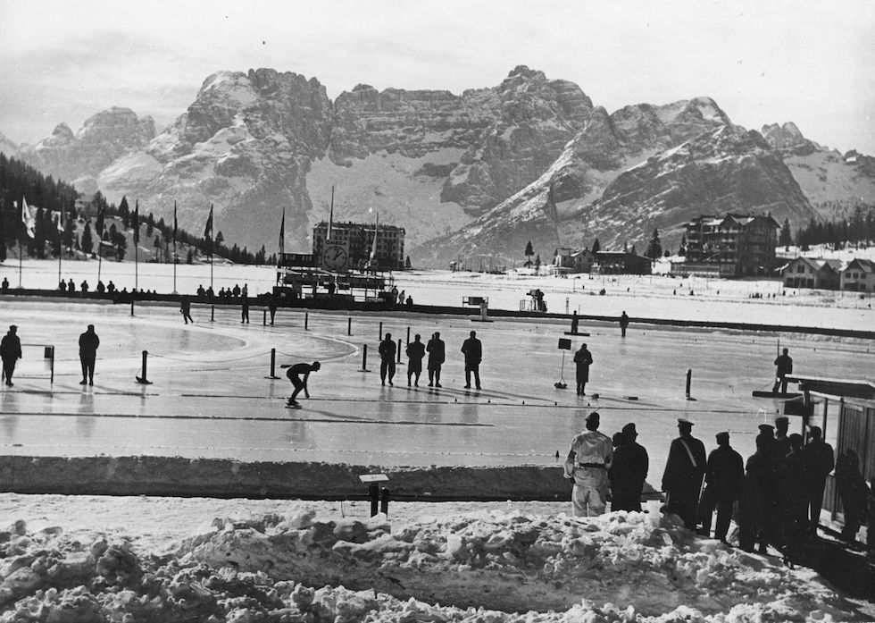
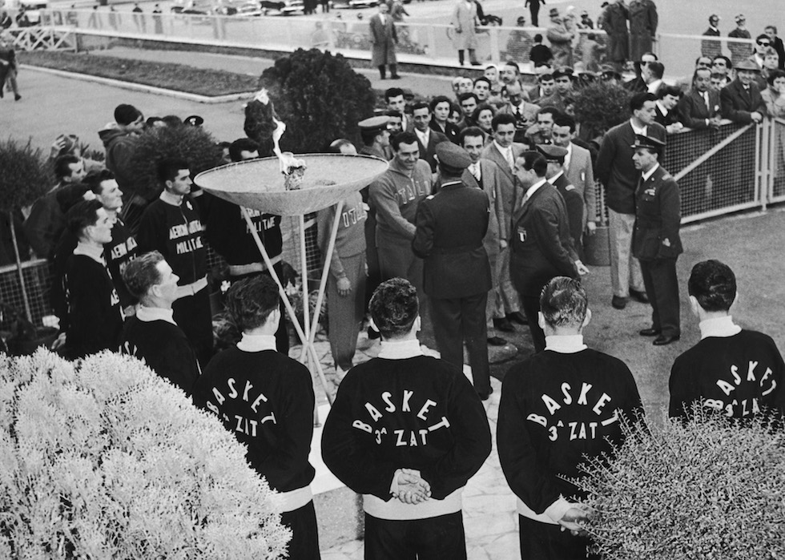
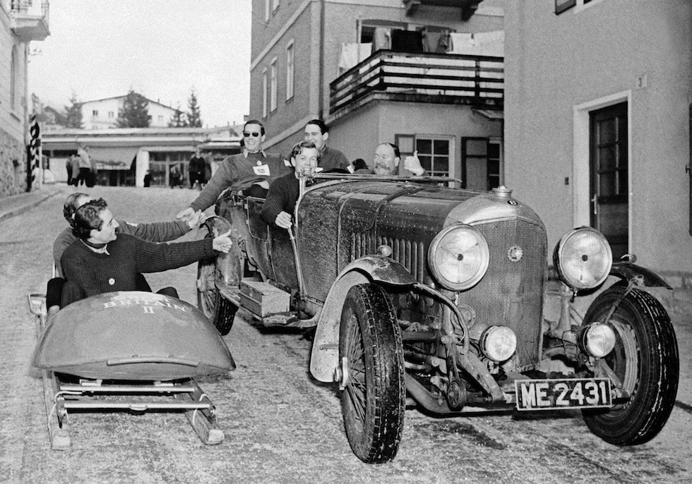

# VII. Cortina d'Ampezzo 1956 {-}

```{r, echo=FALSE, out.width='40%', fig.cap='VII edizione dei Giochi olimpici invernali'}
knitr::include_graphics("images/loghi/1956.png")
```

Si svolgono in Italia.

Dati:

* 32 nazioni
* 821 atleti
* 8 specialità:
  * bob
  * hockey
  * pattinaggio di figura
  * pattinaggio di velocità
  * sci alpino
  * salto con gli sci
  * sci di fondo
  * combinata nordica
  
```{r, echo=FALSE, out.width='80%', fig.cap="La pista del pattinaggio su ghiaccio alle Olimpiadi invernali di Cortina d'Ampezzo del 1956. Nella foto l'atleta sovietico Boris Shilkov. (Keystone/Getty Images)"}

```

```{r, echo=FALSE, out.width='80%', fig.cap="Il generale Felice Porro, capo dell'aeronautica italiana, si congratula con alcuni atleti italiani in partenza per Cortina con la fiamma olimpica. (Keystone/Hulton Archive/Getty Images)"}

```

```{r, echo=FALSE, out.width='80%', fig.cap="Cortina 1956. I due concorrenti della squadra inglese di bob salutano dei passeggeri su una Bentley tra le strade di Cortina d’Ampezzo, il giorno prima della cerimonia di apertura delle Olimpiadi.(Artevitae)"}

```
