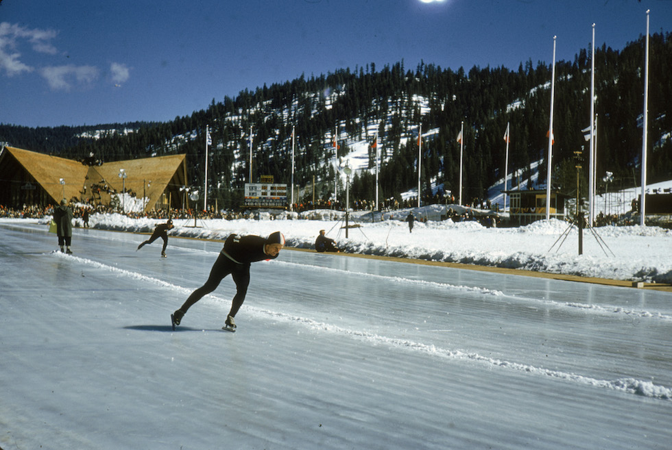
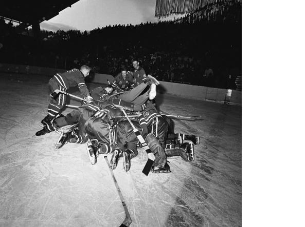

# VIII. Squaw Valley 1960 {-}

```{r, echo=FALSE, out.width='40%', fig.cap='VIII edizione dei Giochi olimpici invernali'}
knitr::include_graphics("images/loghi/1960.png")
```

Si svolgono negli Stati Uniti

Dati:

* 30 nazioni
* 665 atleti
* 8 specialità:
  * biathlon
  * hockey
  * pattinaggio di figura
  * pattinaggio di velocità
  * sci alpino
  * salto con gli sci
  * sci di fondo
  * combinata nordica

```{r, echo=FALSE, out.width='80%', fig.cap='Due atleti nel corso di una sessione di pratica sulla pista di Squaw Valley, in California, nel 1960. (Hulton Archive/Getty Images)'}

```

### Curiosità {-}

Nel 1960 si verificò alle Olimpiadi di Squaw Valley, negli Usa quello che fu ribattezzato "il miracolo dimenticato". La squadra di hockey americana riuscì a battere in finale i favoriti canadesi. Nella foto gli atleti statunitensi festeggiano la vittoria. Al centro s'intravede l'allenatore Jack Riley. 

```{r, echo=FALSE, out.width='80%', fig.cap='(Corriere della Sera)'}

```
