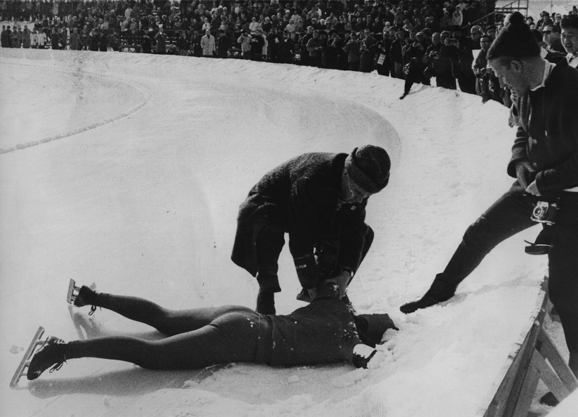
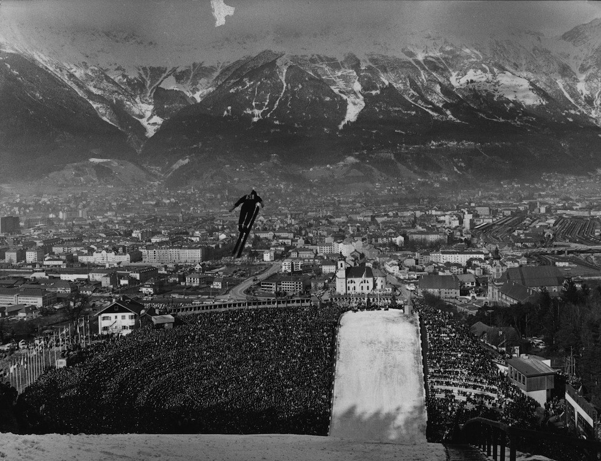

# IX. Innsbruck 1964 {-}

```{r, echo=FALSE, out.width='40%', fig.cap='IX edizione dei Giochi olimpici invernali'}
knitr::include_graphics("images/loghi/1964.png")
```

Si svolgono in Austria.

Dati:

* 36 nazioni
* 1091 atleti
* 10 specialità:
  * biathlon
  * bob
  * hockey
  * pattinaggio di figura
  * pattinaggio di velocità
  * sci alpino
  * salto con gli sci
  * sci di fondo
  * combinata nordica
  * slittino
  
```{r, echo=FALSE, out.width='80%', fig.cap='Innsbruck 1964. Il pattinatore americano Janice Smith con la faccia nella neve dopo aver finito la propria gara dei 1500 metri di pattinaggio.(Artevitae)'}

```
```{r, echo=FALSE, out.width='80%', fig.cap='Innsbruck 1964. Una foto dei circa 80mila spettatori che assisterono alla gara di salto con gli sci.'}

```