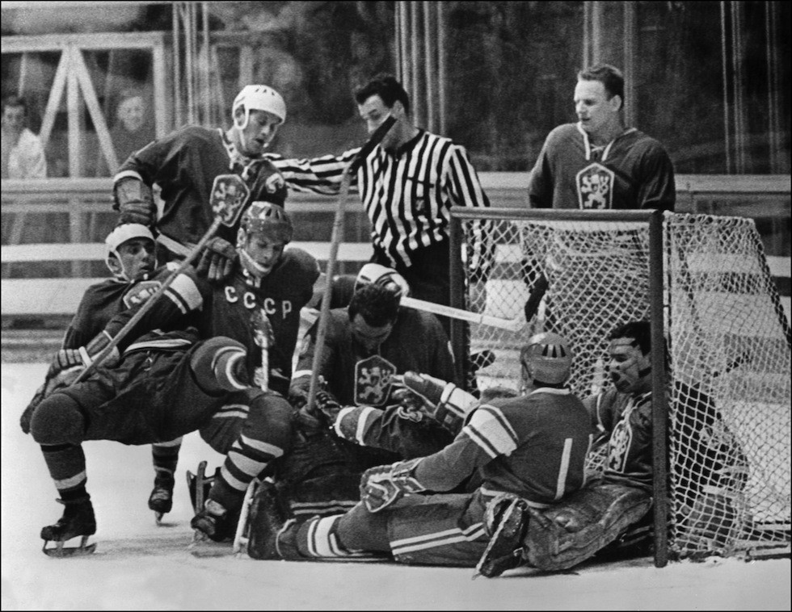

# X. Grenoble 1968 {-}

```{r, echo=FALSE, out.width='40%', fig.cap='X edizione dei Giochi olimpici invernali'}
knitr::include_graphics("images/loghi/1968.png")
```

Si svolgono in Francia.

Dati:

* 37 nazioni
* 1158 atleti
* 10 specialità:
  * biathlon
  * bob
  * combinata nordica
  * hockey
  * pattinaggio di figura
  * pattinaggio di velocità
  * sci alpino
  * salto con gli sci
  * sci di fondo
  * slittino

```{r, echo=FALSE, out.width='80%', fig.cap='Le statunitensi Mary Meyers, Dianne Holum e Jennifer Fish, terze classificate nel pattinaggio di velocità dopo aver fatto registrare lo stesso identico tempo, alle Olimpiadi invernali di Grenoble del 1968. (Allsport Hulton/Archive)'}
knitr::include_graphics("images/IlPost/1968.jpg")
```

```{r, echo=FALSE, out.width='80%', fig.cap="Grenoble 1968. Alcuni giocatori delle squadre di hockey della Cecoslovacchia e dell’URSS sono incastrati nella porta della Cecoslovacchia, durante una partita delle Olimpiadi.(Artevitae)"}

```

### Curiosità {-}

Alle Olimpiadi del 1968 a Grenoble, in Francia, la squadra statunitense fu quasi esclusa dal medagliere olimpico. A salvarla dalla disfatta fu Peggy Flemming che vinse l'oro nel pattinaggio artistico. Fu la prima vittoria del team statunitense dal tragico incidente aereo di Sabena che nel 1961 uccise l'intera squadra di pattinaggio artistico americano.

```{r, echo=FALSE, out.width='80%', fig.cap='(Corriere della Sera)'}
knitr::include_graphics("images/corriere/1968.jpg")
```

Il francese Jean-Claude Killy, dominatore dello sci alpino negli anni '60 trionfò alle Olimpiadi di Grenoble nel 1968 dove vinse tre medaglie d'oro. A causa delle sue performance inimitabili fu soprannominato dai media americani "The Killympics". 

```{r, echo=FALSE, out.width='80%', fig.cap='(Corriere della Sera)'}
knitr::include_graphics("images/corriere/1968(2).jpg")
```

## Mascotte {-}

```{r, echo=FALSE, out.width='40%', fig.cap='Schuss'}
knitr::include_graphics("images/mascotte/Grenoble1968_mascotte.avif")
```

Shuss è un piccolo uomo sugli sci ideato da *Aline Lafargue*. Ufficialmente la prima mascotte ufficialmente riconosciuta dei Giochi olimpici.

Shuss è stato creato molto rapidamente. Nel gennaio 1967, il suo progettista aveva solo una notte per mettere a punto un piano per la presentazione.


Shuss era disponibile in una varietà di articoli: portachiavi, spille, magneti, orologi e persino in una versione gonfiabile.
