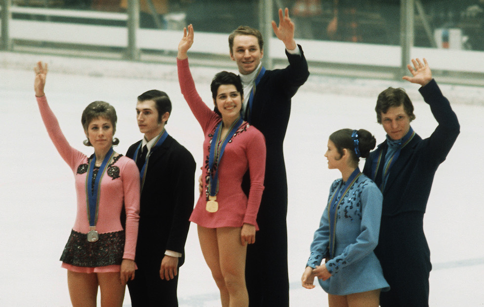
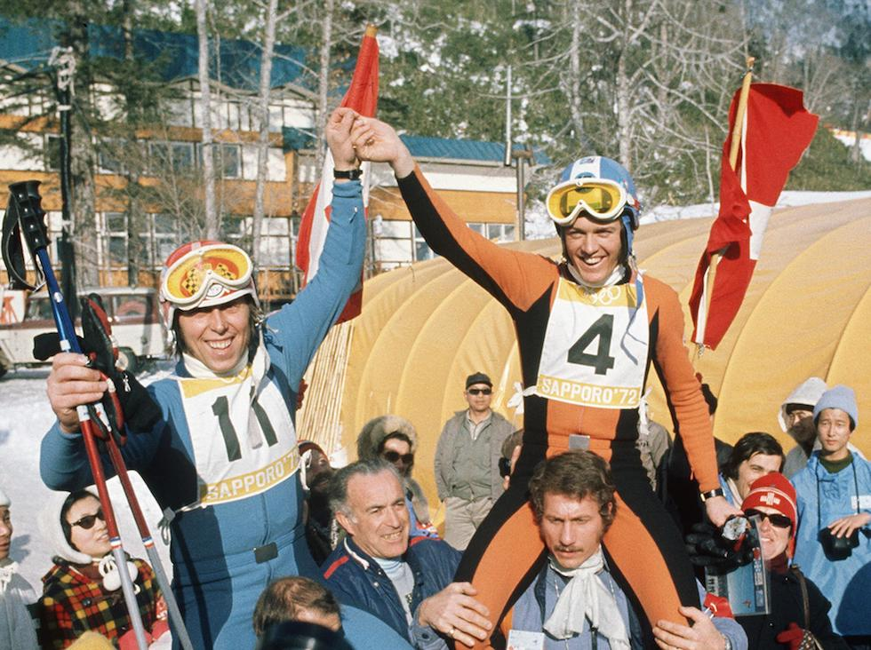

# XI. Sapporo 1972 {-}

```{r, echo=FALSE, out.height='40%', fig.cap='XI edizione dei Giochi olimpici invernali'}
knitr::include_graphics("images/loghi/1972.jpg")
```

Si svolgono in Giappone.

Dati:

* 35 nazioni
* 1006 atleti
* 10 specialità:
  * biathlon
  * bob
  * combinata nordica
  * hockey
  * pattinaggio di figura
  * pattinaggio di velocità
  * sci alpino
  * salto con gli sci
  * sci di fondo
  * slittino

```{r, echo=FALSE, out.height='80%', fig.cap='Irina Rodnina e Alexei Ulanov, vincitori della prova in coppia di pattinaggio artistico, sul podio alle Olimpiadi di Sapporo del 1972. (STAFF/AFP/Getty Images)'}

```

```{r, echo=FALSE, out.height='80%', fig.cap='Il pubblico festeggia gli sciatori svizzeri Bernhard Russi e Rolland Collombin dopo la discesa libera alle Olimpiadi di Sapporo del 1972. (STAFF/AFP/Getty Images)'}

```