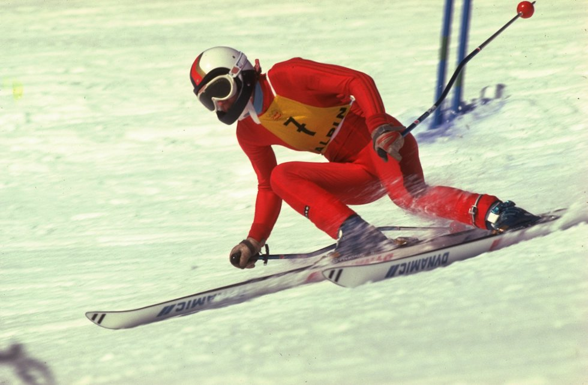
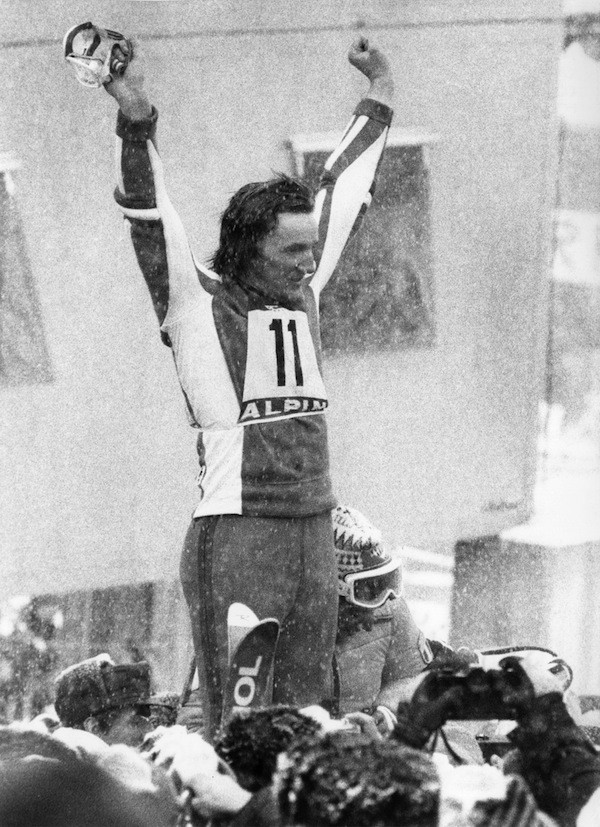

# XII. Innsbruck 1976 {-}

```{r, echo=FALSE, out.width='40%', fig.cap='XII edizione dei Giochi olimpici invernali'}
knitr::include_graphics("images/loghi/1976.png")
```

Si svolgono in Austria.

Dati:

* 37 nazioni
* 1123 atleti
* 10 specialità:
  * biathlon
  * bob
  * combinata nordica
  * hockey
  * pattinaggio di figura
  * pattinaggio di velocità
  * sci alpino
  * salto con gli sci
  * sci di fondo
  * slittino
  
```{r, echo=FALSE, out.width='80%', fig.cap='La sciatrice tedesca Rosie Mittermaier nello slalom alle Olimpiadi di Innsbruck del 1976. (Tony Duffy/Allsport)'}

```

```{r, echo=FALSE, out.width='80%', fig.cap="Insbruck 1976. Lo sciatore italiano Piero Gros dopo aver vinto la medaglia d’oro dello slalom. (Artevitae)"}

```

## Mascotte {-}

```{r, echo=FALSE, out.width='40%', fig.cap='Schneemann'}
knitr::include_graphics("images/mascotte/Innsbruck1976_mascotte.avif")
```

Il nome significa "pupazzo di neve" in tedesco. Schneemann è stato ideato da *Walter Potsch* e indossa un cappello rosso tirolese tipico della regione di Innsbruck.

Schneemann si è rivelato un vero successo commerciale. Sono state create magliette, peluche, oggetti promozionali e le persone hanno iniziato a usare grandi costumi diventando "mascotte viventi" per eventi promozionali.
