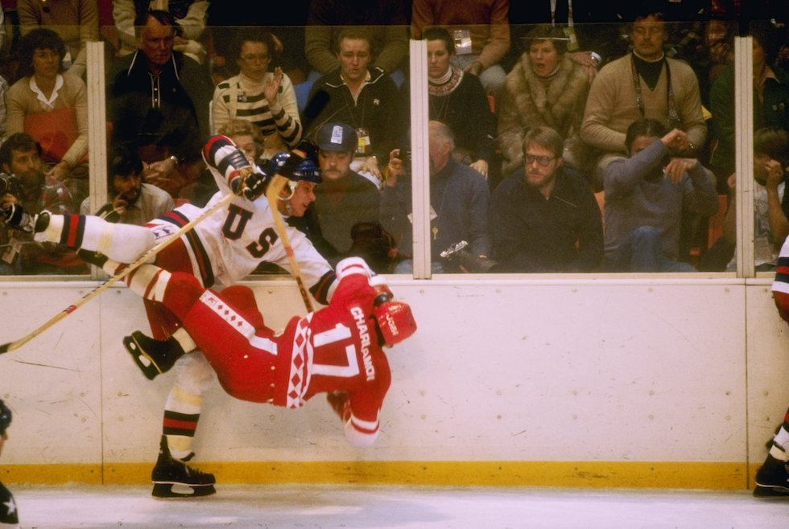
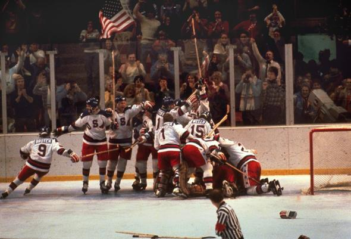

# XIII. Lake Placid 1980 {-}

```{r, echo=FALSE, out.width='40%', fig.cap='XIII edizione dei Giochi olimpici invernali'}
knitr::include_graphics("images/loghi/1980.png")
```

Si svolgono negli Stati Uniti, nello stato di New York.

Dati:

* 37 nazioni
* 1072 atleti
* 10 specialità:
  * biathlon
  * bob
  * combinata nordica
  * hockey
  * pattinaggio di figura
  * pattinaggio di velocità
  * sci alpino
  * salto con gli sci
  * sci di fondo
  * slittino

```{r, echo=FALSE, out.width='80%', fig.cap='Lo statunitense Mike Ramsey e il russo Valeri Kharlamov durante la storica partita tra Stati Uniti e Unione Sovietica nel torneo olimpico di hockey a Lake Placid, nel 1980. (Tony Duffy/Getty Images)'}

```

### Curiosità {-}

"Miracolo sul ghiaccio" è l'appellativo usato negli Stati Uniti per indicare la partita di hockey tra Usa e Urss nei XIII Giochi olimpici invernali, disputati a Lake Placid nel 1980. Il team statunitense, composto da dilettanti e giocatori universitari, sconfisse i favoritissimi russi e successivamente avrebbe conquistato un'improbabile medaglia d'oro. Un film che ricorda l'evento, dal titolo "Miracle On Ice", andò in onda alla televisione americana nel 1981 e venne distribuito nei cinema nel 1989.

```{r, echo=FALSE, out.width='80%', fig.cap='(Corriere della Sera)'}

```

## Mascotte {-}

```{r, echo=FALSE, out.width='40%', fig.cap='Roni'}
knitr::include_graphics("images/mascotte/LakePlacid1980_mascotte.avif")
```

Il nome Roni è stato scelto dai bambini delle scuole di Lake Placid, e deriva dalla parola "procione" in irochese, la lingua dei nativi della regione nello Stato di New York e Lake Placid.

Il procione è un animale abituale nella regione montuosa degli Adirondacks, dove si trova Lake Placid. I tratti del viso del procione e la colorazione bianca e nera intorno agli occhi sono un riferimento agli occhiali da sole e al cappello indossati da alcuni dei concorrenti.

Per promuovere i Giochi, il Comitato Organizzatore ha fatto ricorso anche all'uso di veri procioni: due esemplari dello zoo di Utica sono stati portati a New York per prendere parte allo spettacolo.

La mascotte è stata ideata da *Don Moss, Capital Sports*.
