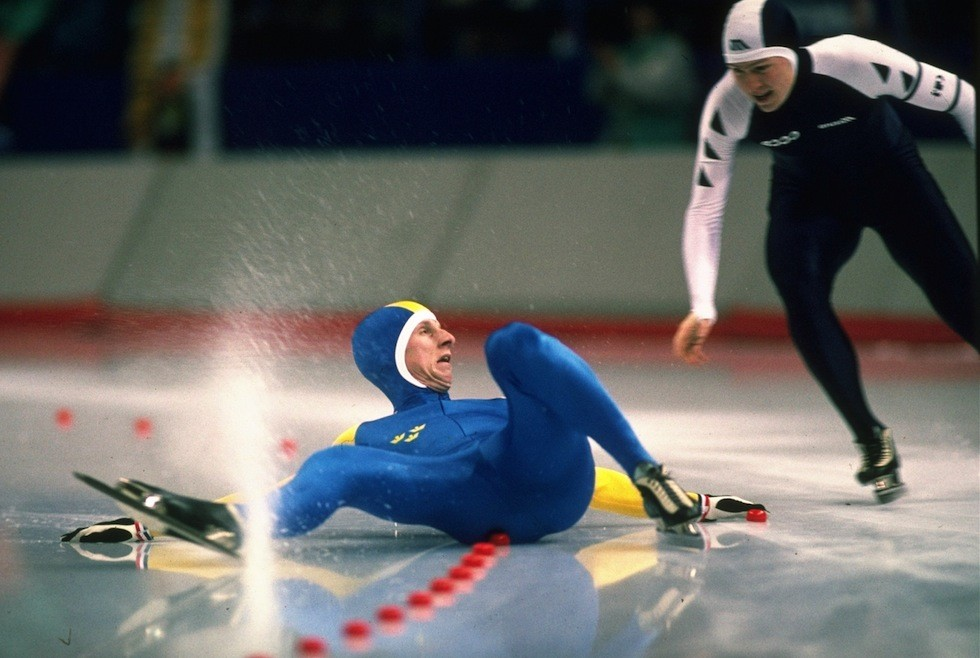
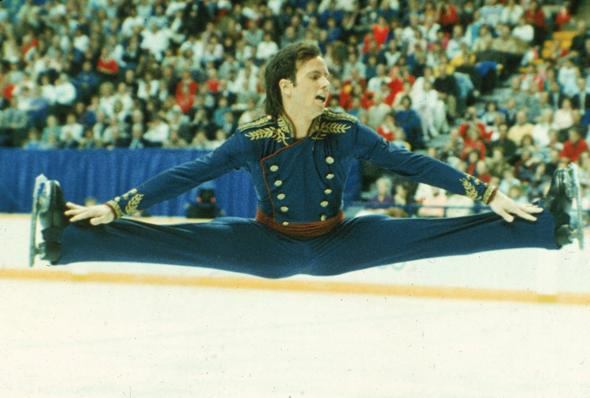

# XV. Calgary 1988 {-}

```{r, echo=FALSE, out.width='40%', fig.cap='XV edizione dei Giochi olimpici invernali'}
knitr::include_graphics("images/loghi/1988.png")
```

Si svolgono in Canada.

Dati:

* 57 nazioni
* 1423 atleti
* 10 specialità:
  * biathlon
  * bob
  * combinata nordica
  * hockey
  * pattinaggio di figura
  * pattinaggio di velocità
  * sci alpino
  * salto con gli sci
  * sci di fondo
  * slittino
  
```{r, echo=FALSE, out.width='80%', fig.cap='La statunitense Erica Terwillegar nella prova di slittino alle Olimpiadi invernali di Calgary del 1988. (Allsport UK /Allsport)'}
knitr::include_graphics("images/IlPost/1988.jpg")
```
```{r, echo=FALSE, out.width='80%', fig.cap="Calgary 1988. Un pattinatore svedese cade mentre uno dell’Unione Sovietica lo supera durante una gara dei 1500 metri di pattinaggio. (Artevitae)"}

```

### Curiosità {-}

Alle Olimpiadi di Calgary in Canada il pubblico assistette alla "battaglia dei Brian", la grande rivalità nel pattinaggio artistico tra l'americano Brian Boitano e il canadese Brian Orser. Entrambi portarono a termine performance incredibili, ma alla fine Boitano vinse l'oro per un decimo di punto.

```{r, echo=FALSE, out.width='80%', fig.cap='(Corriere della Sera)'}

```

## Mascotte {-}

```{r, echo=FALSE, out.width='40%', fig.cap='Hidy e Howdy'}
knitr::include_graphics("images/mascotte/Calgary1988_mascotte.avif")
```

I nomi delle mascotte rappresentano l'ospitalità della regione di Calgary. Quindi “Hidy” è un'estensione di “hi”, e “Howdy” di “how do you do”, espressione tipica dell'America occidentale. Nomi scelti da una giuria di cittadini, dopo una competizione organizzata dallo zoo di Calgary che attirò oltre 7.000 partecipanti.

Hidy e Howdy sono orsi polari, simbolici della regione artica a nord del continente americano. Hanno cappelli e vestiti da cowboy, creati da *Sheila Scott* (Great Scott Productions).

Howdy e sua sorella Hidy sono la prima coppia di mascotte.
