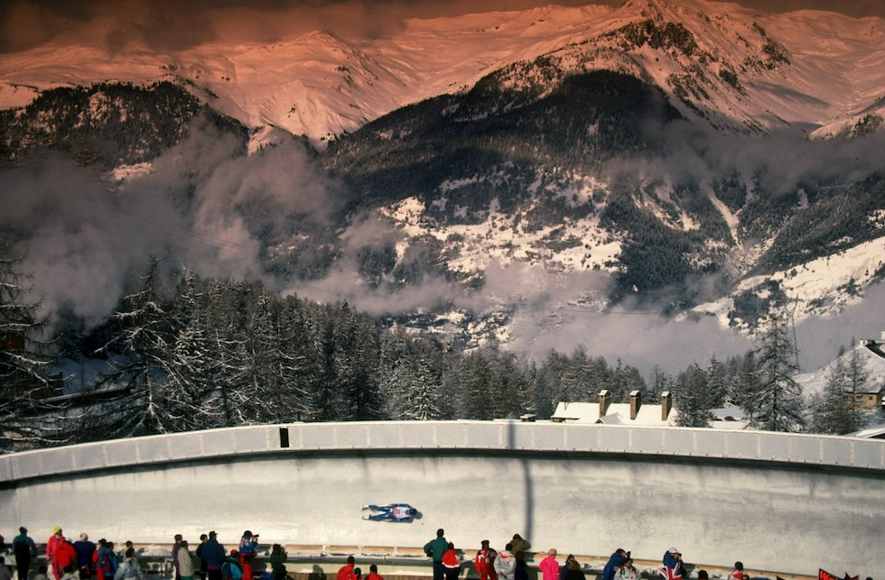
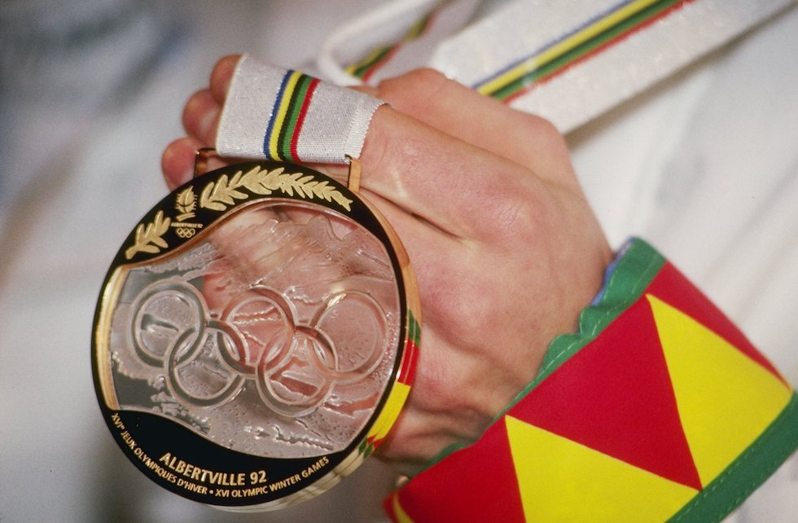

# XVI. Albertville 1992 {-}

```{r, echo=FALSE, out.width='40%', fig.cap='XVI edizione dei Giochi olimpici invernali'}
knitr::include_graphics("images/loghi/1992.png")
```

Si svolgono in Francia.

Dati:

* 64 nazioni
* 1801 atleti
* 12 specialità:
  * biathlon
  * bob
  * combinata nordica
  * freestyle
  * hockey
  * pattinaggio di figura
  * pattinaggio di velocità
  * sci alpino
  * salto con gli sci
  * sci di fondo
  * short track
  * slittino
  
```{r, echo=FALSE, out.width='80%', fig.cap='La vista dalle tribune della pista di bob delle Olimpiadi di Albertville del 1992. (Pascal Rondeau/Allsport)'}

``` 

```{r, echo=FALSE, out.width='80%', fig.cap="La medaglia d'oro delle Olimpiadi di Albertville. (Getty Images)"}

``` 

```{r, echo=FALSE, out.width='80%', fig.cap="Il norvegese Johann Olav Koss nella prova di pattinaggio di velocità alle Olimpiadi di Albertville del 1992, dove vincerà la medaglia d'oro. (Getty Images)"}
knitr::include_graphics("images/IlPost/1992(3).jpg")
``` 

## Mascotte {-}

```{r, echo=FALSE, out.width='40%', fig.cap='Magique'}
knitr::include_graphics("images/mascotte/Albertville1992_mascotte.avif")
```

Un piccolo bambino a forma di stella e un cubo, Magique è la prima mascotte non animale dai Giochi di Innsbruck 1976. La forma di stella simbolizza sogni e immaginazione. I colori provengono dalla bandiera francese.

Ideata da *Philippe Mairesse*, ci sono voluti diversi studi finanziati dal Comitato Organizzatore (OCOG) per trovare un nome alla mascotte senza però riuscirci. Rileggendo i suoi appunti, il creatore capisce che la parola “magico” ricorre spesso. Con entusiasmo l'OCOG decide di chiamare così la mascotte.

Originariamente, la mascotte era un caprone di montagna creato dall'illustratore Michel Pirus. L'idea di un bambino a forma di stella nasce due anni prima dei Giochi.

La mascotte aveva uno scopo pedagogico: per formare i 7.924 volontari dei Giochi, l'OCOG crea un programma educativo di informatica in cui Magique appare in diversi moduli di insegnamento e nei giochi.
