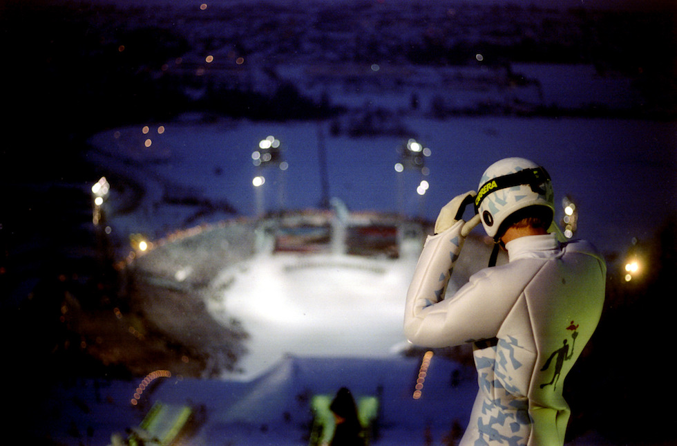
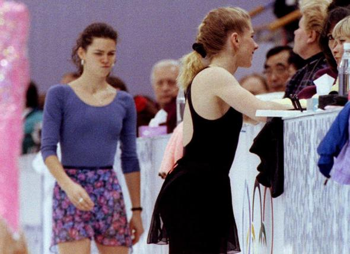

# XVII. Lillehammer 1994 {-}

```{r, echo=FALSE, out.width='40%', fig.cap='XVII edizione dei Giochi olimpici invernali'}
knitr::include_graphics("images/loghi/1994.png")
```

Si svolgono in Norvegia.

Dati:

* 67 nazioni
* 1739 atleti
* 12 specialità:
  * biathlon
  * bob
  * combinata nordica
  * freestyle
  * hockey
  * pattinaggio di figura
  * pattinaggio di velocità
  * sci alpino
  * salto con gli sci
  * sci di fondo
  * short track
  * slittino

```{r, echo=FALSE, out.width='80%', fig.cap='Il saltatore norvegese Stein Gruben si prepara a percorrere un tratto di discesa con la torcia olimpica nella cerimonia inaugurale delle Olimpiadi di Lillehammer del 1994. (Bob Martin/ALLSPORT)'}

```

```{r, echo=FALSE, out.width='80%', fig.cap='Il norvegese Bjorn Daehlie fra il pubblico nella 15 chilometri di fondo alle Olimpiadi del 1994 di Lillehammer. (Clive Brunskill/ALLSPORT)'}
knitr::include_graphics("images/IlPost/1994(2).jpg")
```

###Curiosità {-}

La più grande rivalità dei Giochi del 1994 a Lillehammer, in Norvegia, fu tra le pattinatrici americane Tonya Harding (a destra) e Nancy Kerrigan (a sinistra). Un mese prima della rassegna olimpica, l'ex marito di Harding colpì a un ginocchio con un manganello della polizia Kerrigan sulle ginocchia per tenerla fuori dai Giochi. Nonostante ciò Kerrigan riuscì a vincere la medaglia d'argento, mentre la rivale finì solo ottava. 

```{r, echo=FALSE, out.width='80%', fig.cap='(Corriere della Sera)'}

```

## Mascotte {-}

```{r, echo=FALSE, out.width='40%', fig.cap='Haakon e Kristin'}
knitr::include_graphics("images/mascotte/Lillehammer1994_mascotte.avif")
```

I nomi delle mascotte, create da *Kari e Werner Grossman*, su un'idea di *Javier Ramirez Campuzano*, si riferiscono a personaggi storici del 13° secolo, il cui destino è strettamente legato alla Norvegia e alla regione di Lillehammer: Håkon IV Håkonson, re di Norvegia dal 1217 al 1263, e la principessa Kristin, sua zia.

I due bambini felici sono le prime mascotte in forma umana. Anche se indossano abiti medievali in riferimento alle loro radici storiche, sono bambini moderni ed esprimono gli interessi e le visioni dei giovani, come la consapevolezza ambientale.

Due piste di pattinaggio situate una accanto all'altra e che portano i nomi delle mascotte hanno ospitato gli eventi Olimpici e Paralimpici del 1994: la Hakons Hall e la Kristins Hall.

Le figure storiche che hanno ispirato le mascotte sono vissute durante un periodo travagliato in Norvegia dove due tribù, i Birkebeiner e i Bagler, combattevano per il potere. Anche se era solo un bambino, Håkon Håkonson, minacciato dai Baglers, dovette fuggire da Lillehammer attraverso le montagne con i suoi fedeli. La principessa Birkebeiner Kristin Sverrisdóttir sposò il capo dei Baglers, Filippus Símonsson, per portare la pace tra le due fazioni.
