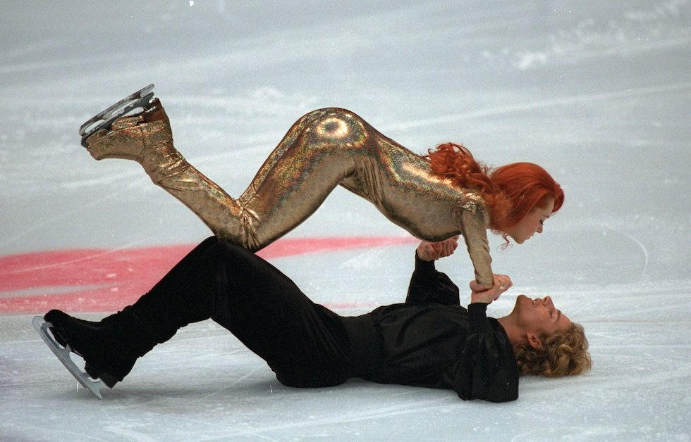
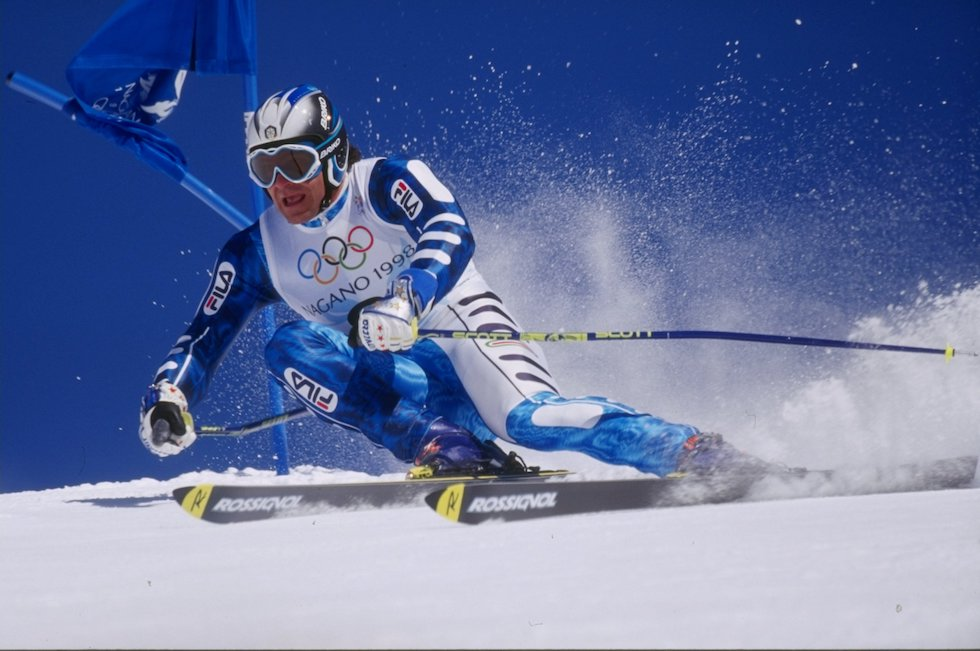
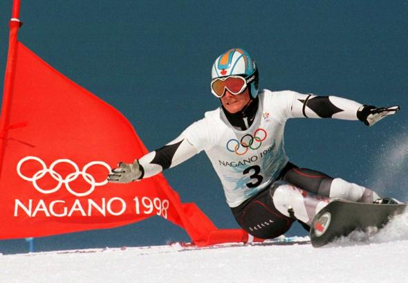

# XVIII. Nagano 1998 {-}

```{r, echo=FALSE, out.width='40%', fig.cap='XVIII edizione dei Giochi olimpici invernali'}
knitr::include_graphics("images/loghi/1998.png")
```

Si svolgono in Giappone.

Dati:

* 72 nazioni
* 2302 atleti
* 14 specialità:
  * biathlon
  * bob
  * combinata nordica
  * curling
  * freestyle
  * hockey
  * pattinaggio di figura
  * pattinaggio di velocità
  * sci alpino
  * salto con gli sci
  * sci di fondo
  * short track
  * slittino
  * snowboard
  
```{r, echo=FALSE, out.width='80%', fig.cap='I pattinatori francesi Marina Anissina e Gwendal Peizerat nella loro esibizione alle Olimpiadi invernali del 1998 a Nagano. (Clive Brunskill /Allsport)'}

```

```{r, echo=FALSE, out.width='80%', fig.cap='Alberto Tomba nello slalom gigante di Shiga Kogen alle Olimpiadi invernali di Nagano del 1998. (Clive Brunskill /Allsport)'}

```

### Curiosità {-}

Le Olimpiadi Invernali del 1998 a Nagano, in Giappone, furono le prime a presentare gare di snowboard. Il canadese Ross Rebagliati conquistò la medaglia d'oro olimpica nello snowboard - slalom gigante. 

```{r, echo=FALSE, out.width='80%', fig.cap='(Corriere della Sera'}

```

## Mascotte {-}

```{r, echo=FALSE, out.width='40%', fig.cap='Sukki, Nokki, Lekki e Tsukki'}
knitr::include_graphics("images/mascotte/Nagano1998_mascotte.avif")
```

I gufi Sukki, Nokki, Lekki e Tsukki sono anche noti come gli Snowlets. “Snow” – neve – si riferisce alla stagione invernale in cui si disputano i Giochi, “lets” si riferisce a “let’s”, un invito a partecipare alla festa Olimpica. Inoltre, le prime due lettere dei nomi messe insieme formano “snowlets”. “Owlets” significa giovani gufi.

Ideati da *Landor Associates*, Sukki, Nokki, Lekki e Tsukki sono quattro gufi della neve. Rappresentano, rispettivamente, fuoco (Sukki), aria (Nokki), terra (Lekki) e acqua (Tsukki). La scelta delle quattro mascotte è legata ai quattro anni che separano le Olimpiadi.

Originariamente, la mascotte dei Giochi di Nagano doveva essere una donnola di nome “Snowple”.

I gufi vengono venerati nel mondo, considerati i “saggi del bosco”; nella mitologia greca il gufo è associato ad Atena, la dea della saggezza.

I nomi dei quattro Snowlets scelti tra 47.484 suggerimenti.
