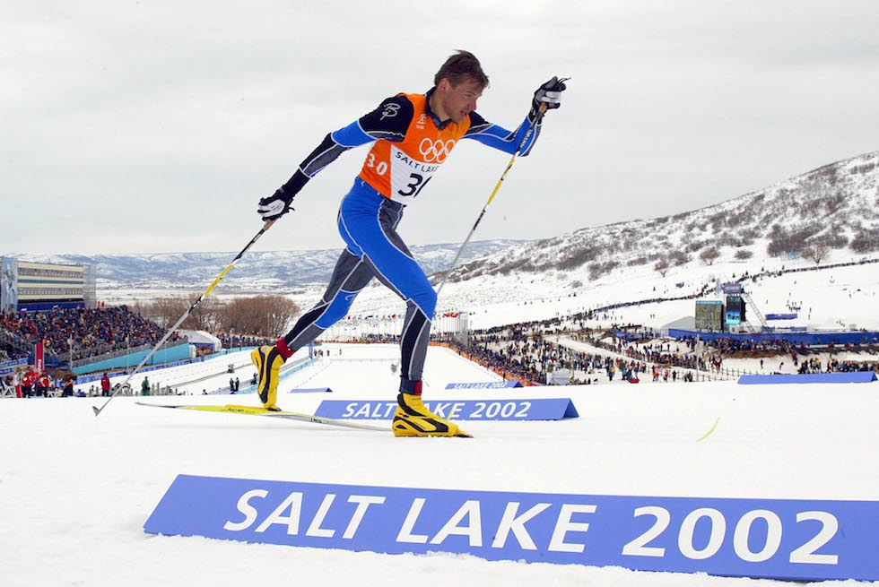
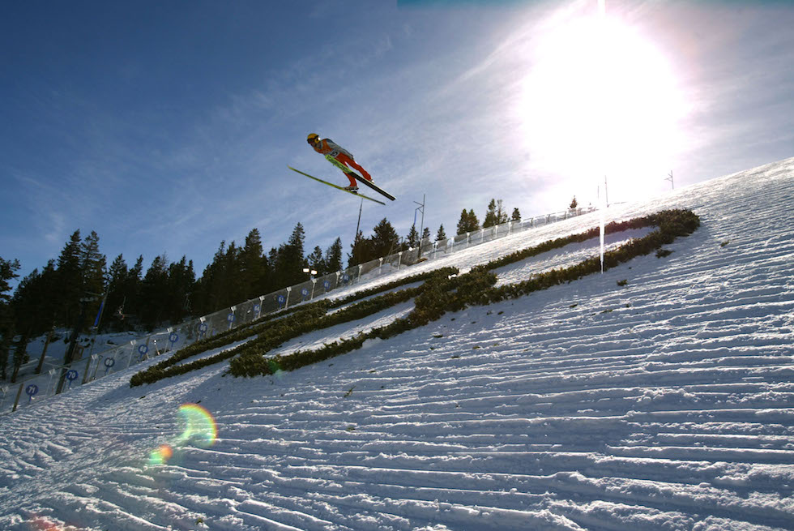
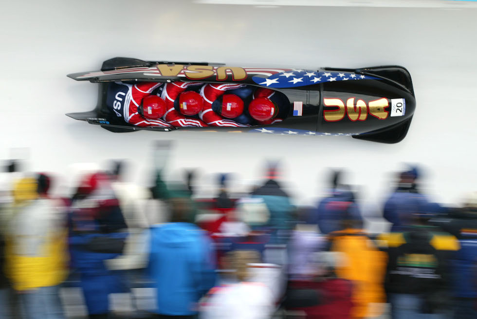
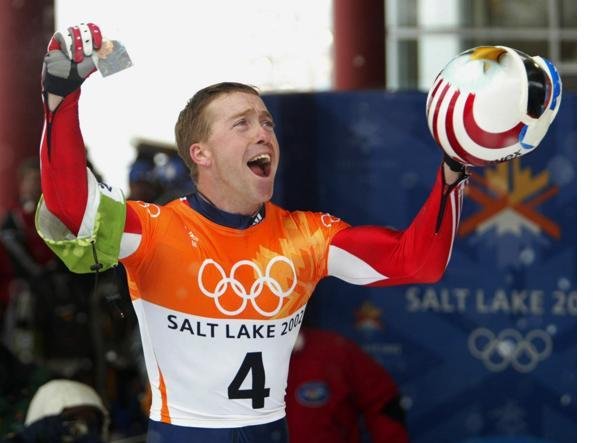
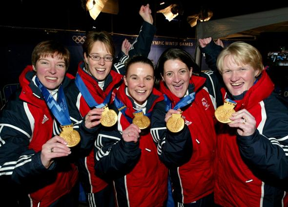
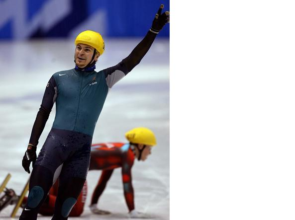

# XIX. Salt Lake City 2002 {-}

```{r, echo=FALSE, out.width='40%', fig.cap='XIX edizione dei Giochi olimpici invernali'}
knitr::include_graphics("images/loghi/2002.png")
```

Si svolgono negli Stati Uniti, nella capitale dello Utah.

Dati:

* 77 nazioni
* 2399 atleti
* 15 specialità:
  * biathlon
  * bob
  * combinata nordica
  * curling
  * freestyle
  * hockey
  * pattinaggio di figura
  * pattinaggio di velocità
  * sci alpino
  * salto con gli sci
  * sci di fondo
  * short track
  * skeleton
  * slittino
  * snowboard

```{r, echo=FALSE, out.width='80%', fig.cap="L'estone Andrus Veerpalu nella gara di sci di fondo a Salt Lake City nel 2002. (Zoom Agence/Getty Images)"}

```

```{r, echo=FALSE, out.width='80%', fig.cap="Una foto scattata allo Utah Olympic Park di Park City durante la prova di salto con gli sci alle Olimpiadi di Salt Lake City. (Jed Jacobsohn /Getty Images)"}

```

```{r, echo=FALSE, out.width='80%', fig.cap='La squadra statunitense del bob alle Olimpiadi di Salt Lake City del 2002. (Getty Images)'}

```

### Curiosità {-}

Alle Olimpiadi del 2002 a Salt Lake City, Jim Shea, skeletonista statunitense, conquista l'oro e diventa un campione olimpico di terza generazione. Suo padre infatti aveva gareggiato in gare di sci di fondo, mentre suo nonno era Jack Shea, il famoso pattinatore olimpico, vincitore di due medaglie d'oro ai Giochi di Lake Placid del 1932. 

```{r, echo=FALSE, out.width='80%', fig.cap='(Corriere della Sera'}

```
Nel 2002, la squadra femminile di curling britannica ha portato a casa il primo oro olimpico in 18 anni di competizioni. Il team era composto da "casalinghe superstar" come furono ribattezzate le atlete sulle prime pagine dei tabloid d'Oltremanica.

```{r, echo=FALSE, out.width='80%', fig.cap='(Corriere della Sera'}

```
Nel 2002, il pattinatore Steven Bradbury ha vinto il primo oro olimpico invernale dell'Australia nella storia, dopo che tutti gli avversari sono caduti nel tratto finale della gara. Da allora nel Paese anglofono l'espressione "doing a Bradbury" (fare un Bradbury) è sinonimo di "successo clamoroso e altamente insperato". 
```{r, echo=FALSE, out.width='80%', fig.cap='(Corriere della Sera'}

```

## Mascotte {-}

```{r, echo=FALSE, out.width='40%', fig.cap='Powder, Coal e Copper'}
knitr::include_graphics("images/mascotte/SaltLakeCity2002_mascotte.avif")
```

I nomi Powder (polvere), Coal (carbone) e Copper (rame) sono un'allusione alla neve, alle risorse naturali e alla terra dello Utah. 
Ideati da *Landor/Publicis* a partire da consigli arrivati da oltre 42.000 studenti. Il Comitato Organizzatore lancia una competizione nazionale per decidere i nomi. Altre opzioni erano: Sky, Cliff, Shadow, Arrow, Bolt e Rocky.

Powder è una lepre con racchette da neve, Copper è un coyote e Coal un orso bruno. La velocità della lepre, la capacità di arrampicarsi del coyote e la forza dell'orso rappresentano il motto Olimpico "*Citius, Altius, Fortius"* (più veloce, più in alto, più forte). L'ispirazione viene dall'antica cultura dello Utah.
Ognuno dei tre indossa una collana con la forma dell'animale che rappresenta, disegnato come le incisioni rupestri nello stile degli Anasazis o dei Fremonts, antiche popolazioni della regione. Inoltre, i tre animali erano spesso protagonisti delle antiche leggende americane, passate di generazione in generazione.
