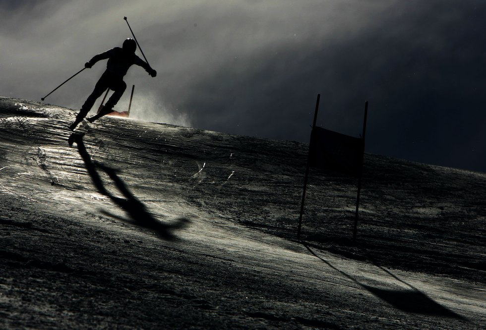
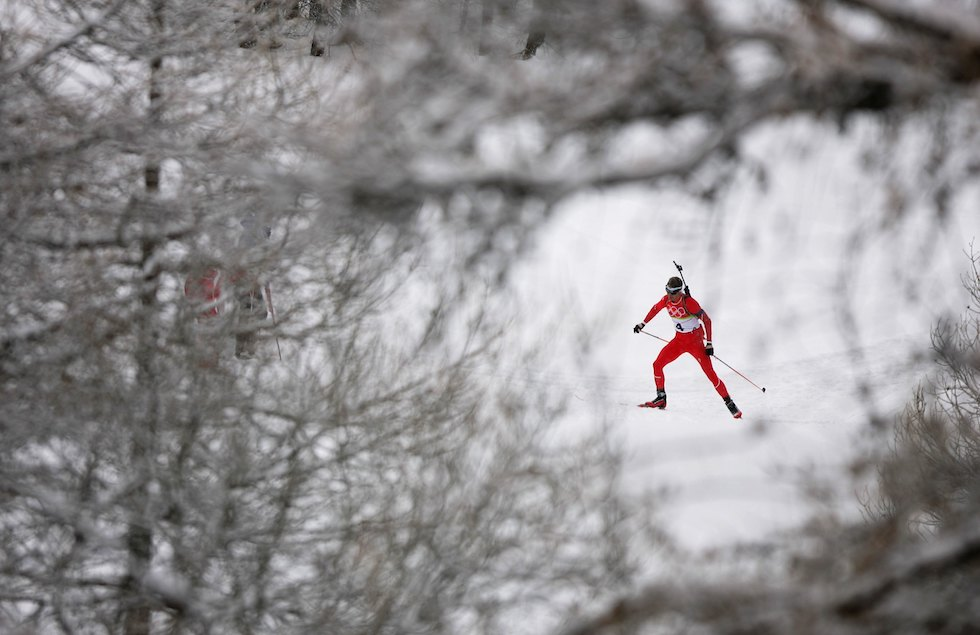

# XX. Torino 2006 {-}

```{r, echo=FALSE, out.width='40%', fig.cap='XX edizione dei Giochi olimpici invernali'}
knitr::include_graphics("images/loghi/2006.png")
```

Si svolgono in Italia.

Dati:

* 80 nazioni
* 2633 atleti
* 15 specialità:
  * biathlon
  * bob
  * combinata nordica
  * curling
  * freestyle
  * hockey
  * pattinaggio di figura
  * pattinaggio di velocità
  * sci alpino
  * salto con gli sci
  * sci di fondo
  * short track
  * skeleton
  * slittino
  * snowboard

```{r, echo=FALSE, out.width='80%', fig.cap='Il georgiano Iason Abramashvili nello slalom gigante alle Olimpiadi di Torino del 2006. (Donald Miralle/Getty Images)'}

```

```{r, echo=FALSE, out.width='80%', fig.cap='Il norvegese Ole Einar Bjoerndalen nella gara di biathlon alle Olimpiadi di Torino del 2006. (Donald Miralle/Getty Images)'}

```

## Mascotte {-}

```{r, echo=FALSE, out.width='40%', fig.cap='Neve e Gliz'}
knitr::include_graphics("images/mascotte/Torino2006_mascotte.avif")
```

Creati da *Pedro Albuquerque*, Neve è una palla di neve, Gliz è un cubo di ghiaccio. 
Insieme, formano gli elementi necessari per i Giochi Invernali e rappresentano gli sport invernali.

Neve, vestita di rosso con contorni fluidi e rotondi, rappresenta l'armonia e l'eleganza dei movimenti.
La forma spigolosa di Gliz, vestito di blu, richiama invece la potenza e la forza degli atleti.

La creazione delle mascotte arriva da una gara internazionale lanciata tre anni prima dei Giochi. La gara era aperta ad agenzie di design-pubblicità e grafica oltre che a designer indipendenti. Cinque i finalisti selezionati tra le 237 proposte arrivate: il vincitore è stato un designer portoghese, scelto dall'ufficio presidenziale del comitato organizzatore.

Un cartone animato di 52 episodi da un minuto con Neve e Gliz protagonisti è stato trasmesso dai canali TV italiani RAI 2 e RAI 3, dall'ottobre del 2005 al febbraio del 2006. Ogni episodio copre aspetti delle Olimpiadi: valori, territorio, sport, etc.
