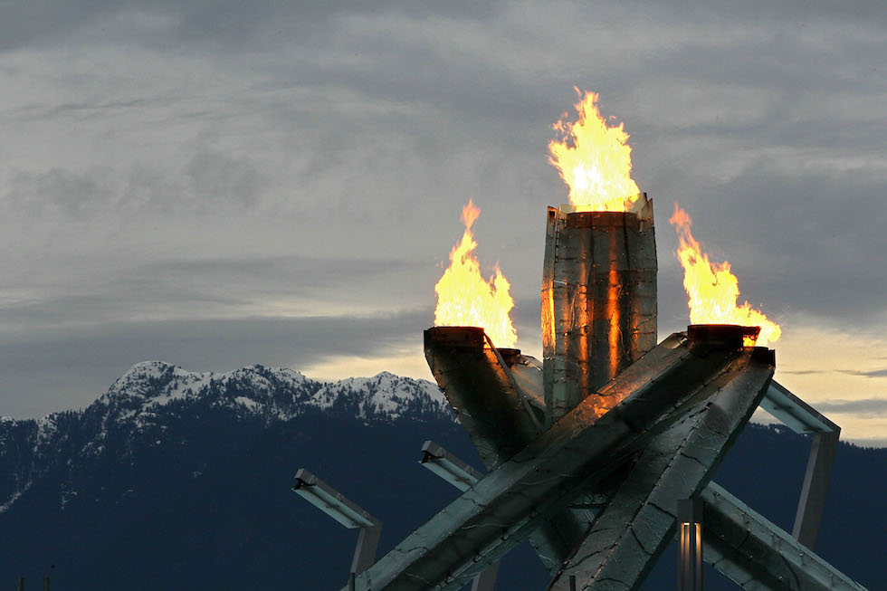

# XXI. Vancouver 2010 {-}

```{r, echo=FALSE, out.width='40%', fig.cap='XXI edizione dei Giochi olimpici invernali'}
knitr::include_graphics("images/loghi/2010.png")
```

Si svolgono in Canada.

Dati:

* 82 nazioni
* 2622 atleti
* 15 specialità:
  * biathlon
  * bob
  * combinata nordica
  * curling
  * freestyle
  * hockey
  * pattinaggio di figura
  * pattinaggio di velocità
  * sci alpino
  * salto con gli sci
  * sci di fondo
  * short track
  * skeleton
  * slittino
  * snowboard

```{r, echo=FALSE, out.width='80%', fig.cap='La statunitense Hannah Kearney nella prova di freestyle femminile alle Olimpiadi di Vancouver del 2010. (Streeter Lecka/Getty Images)'}
knitr::include_graphics("images/IlPost/2010.jpg")
```

```{r, echo=FALSE, out.width='80%', fig.cap='Il braciere olimpico delle Olimpiadi di Vancouver del 2010. (Getty Images)'}

```

## Mascotte {-}

```{r, echo=FALSE, out.width='40%', fig.cap='Quatchi e Miga'}
knitr::include_graphics("images/mascotte/Vancouver2010_mascotte.avif")
```

Le mascotte dei Giochi di Vancouver sono creature ispirate alla fauna e ai racconti delle Prime Nazioni native sulla costa occidentale del Canada.

Quatchi è uno "sasquatch", un personaggio popolare delle leggende locali che vive nella foresta. È coperto da una folta pelliccia e indossa stivali e paraorecchie.

Miga è un orso marino, un animale mitico che è in parte orca e in parte orso Kermode. L'orso Kermode, chiamato anche "Orso Spirito", vive solo nella British Columbia.

Il Comitato Organizzatore ha lanciato una gara d'appalto tra agenzie d'illustrazione e professionisti, a cui hanno risposto in 177. Cinque disegnatori sono stati selezionati per mettere in atto uno studio più dettagliato delle proposte: alla fine, è stato *Meomi design* a vincere.

```{r, echo=FALSE, out.width='40%', fig.cap='Quatchi e Miga'}
knitr::include_graphics("images/mascotte/mukmuk.png")
```

Quatchi e Miga hanno un amico chiamato "Mukmuk", che si è rivelato molto popolare, anche se non è una mascotte ufficiale. Mukmuk è stato ispirato da un raro tipo di marmotta, in pericolo di estinzione, che vive solamente su un'isola nei pressi di Vancouver. Il suo nome deriva dalla parola "muckamuck", che significa "cibo" in Chinook. Sebbene all'inizio esistesse solo virtualmente e sulla carta, in seguito è stato riprodotto in una gamma di prodotti.
