--- 
title: "Storia dei Giochi Olimpici Invernali"
author: "Adriana Angaran"
date: "17 giugno 2024"
documentclass: book
bibliography: [book.bib, packages.bib]
cover-image: images/cover.jpg
description: |
  This is a short illustrated book about the history of the Winter Olympic games from 1924 to 2026.
  The HTML output format for is bookdown::gitbook,
  set in the _output.yml file.
link-citations: yes
github-repo: https://github.com/AdrianaAngaran/Storia-Giochi-Olimpici-Invernali.git
---

# Introduzione {-}

```{r, echo=FALSE, out.width='70%', fig.cap='I 5 cerchi olimpici'}
knitr::include_graphics("images/cerchi.png")
```

I Giochi olimpici invernali sono un evento sportivo in cui atleti di ogni nazione gareggiano negli sport invernali, ovvero sport che si svolgono sul ghiaccio o sulla neve.
Sono nati dopo i Giochi olimpici e si disputano dal 1924 ogni quattro anni. Fino al 1992 si disputavano nello stesso anno di quelli estivi, dal 1994 si disputano negli anni pari non divisibili per quattro.

## Nascita {-}
Nel 1894 venne fondato il Comitato Olimpico Internazionale (CIO) e nel 1896 ad Atene venne disputata la prima edizione dei Giochi olimpici dell'era moderna. 
In occasione dei Giochi olimpici di Londra 1908 il pattinaggio di figura venne inserito nel programma olimpico per la prima volta.
Sin dal 1901, prima con cadenza biennale e poi quadriennale, si disputavano in Svezia i **Giochi nordici** sotto la guida del generale *Viktor Balck*, membro del CIO e amico di *Pierre de Coubertin*, "padre" dei Giochi olimpici moderni.

Nel corso della sessione del CIO a Budapest nel 1911, in vista dei Giochi olimpici di Stoccolma dell'anno seguente, il conte italiano *Eugenio Brunetta d'Usseaux* propose di inserire nel programma di gare anche degli sport invernali e quindi di includere l'edizione 1913 dei Giochi nordici nei Giochi della V Olimpiade. Questa proposta venne rigettata dal comitato organizzatore dei Giochi olimpici di Stoccolma e dallo stesso Balck con l'obiettivo di preservare l'indipendenza dei Giochi nordici, così che il 27 maggio 1911 la proposta venne definitivamente respinta.

Nel congresso CIO di Parigi nel giugno 1914 venne ridiscussa l'idea di includere sport invernali nel programma olimpico in vista dei Giochi olimpici di Berlino e venne deciso di aggiungere al programma olimpico il pattinaggio di figura e di velocità, lo sci nordico e l'hockey su ghiaccio. 

Lo scoppio della prima guerra mondiale pochi mesi dopo costrinse all'annullamento dei Giochi della VI Olimpiade.

In occasione dei Giochi della VII Olimpiade di Anversa venne organizzata una settimana dedicata agli sport su ghiaccio dal 23 al 30 aprile 1920, con i tornei olimpici di hockey su ghiaccio e di pattinaggio di figura.

Al congresso del CIO del 1921 si decise che la nazione organizzatrice dell'edizione successiva dei Giochi olimpici, la Francia, avrebbe anche ospitato una distinta **"Settimana internazionale degli sport invernali"**, sotto il patrocinio dello stesso CIO. 
Nel 1922 si tenne un congresso della commissione internazionale dello sci, che portò alla nascita, il 2 febbraio, della Federazione Internazionale Sci (FIS). 

Dal 25 gennaio al 4 febbraio 1924 si tenne la "Settimana internazionale degli sport invernali" a Chamonix-Mont-Blanc, alla quale parteciparono complessivamente 258 atleti in rappresentanza di 16 nazioni, che si cimentarono in 16 gare di 6 diverse discipline. 
Dato il successo della "Settimana internazionale degli sport invernali" il 6 maggio 1926, il CIO decise di istituire i **Giochi olimpici invernali**, da svolgersi ogni quattro anni come i già esistenti Giochi olimpici estivi. 
Nella stessa sessione il CIO decise di designare retroattivamente le gare di Chamonix come I Giochi olimpici invernali, anche su pressione dei Paesi nordici, e di assegnare a Sankt Moritz l'organizzazione della seconda edizione nel 1928.

## Curiosità {-}

I Paesi che hanno ospitato più Olimpiadi invernali:

* Stati Uniti: 4
* Francia: 3 
* Italia: 3 (contando la prossima edizione dei Giochi di Milano-Cortina 2026)
* Austria: 2
* Svizzera: 2
* Norvegia: 2
* Canada: 2
* Giappone: 2

<!--Render book

```{r, eval=FALSE, echo=FALSE}
bookdown::render_book()
```

Preview book

```{r, eval=FALSE}
bookdown::serve_book()
```

Create packages.bib
```{r include=FALSE}
# automatically create a bib database for R packages
knitr::write_bib(c(
  .packages(), 'bookdown', 'knitr', 'rmarkdown'
), 'packages.bib')
```
-->

<!--chapter:end:index.Rmd-->

# I. Chamonix-Mont-Blanc 1924 {-}

```{r, echo=FALSE, out.width='40%', fig.cap='I edizione dei Giochi olimpici invernali'}
knitr::include_graphics("images/loghi/1924.jpg")
```

Si disputa in Francia come "Settimana internazionale degli sport invernali" sotto il patrocinio del CIO, che nel 1925 la riconosce come prima edizione dei Giochi olimpici invernali.

Dati:

* 16 nazioni
* 258 atleti
* 6 discipline:
  * combinata nordica
  * bob 
  * curling (dimostrativo)
  * hockey su ghiaccio
  * sci
  * pattinaggio
  
```{r, echo=FALSE, out.width='80%', fig.cap='La Nazionale canadese di hockey a Chamonix nel 1924 per la prima edizione delle Olimpiadi invernali. (Topical Press Agency/Getty Images)'}
knitr::include_graphics("images/IlPost/1924.jpg")
```

```{r, echo=FALSE, out.width='80%', fig.cap='La squadra inglese di curling a Chamonix nel 1924 per la prima edizione delle Olimpiadi invernali. (Topical Press Agency/Getty Images)'}
knitr::include_graphics("images/IlPost/1924(2).jpg")
```

```{r, echo=FALSE, out.width='80%', fig.cap='La squadra di bob inglese durante il torneo olimpico di Chamonix nel 1924. (Topical Press Agency/Hulton Archive/Getty Images)'}
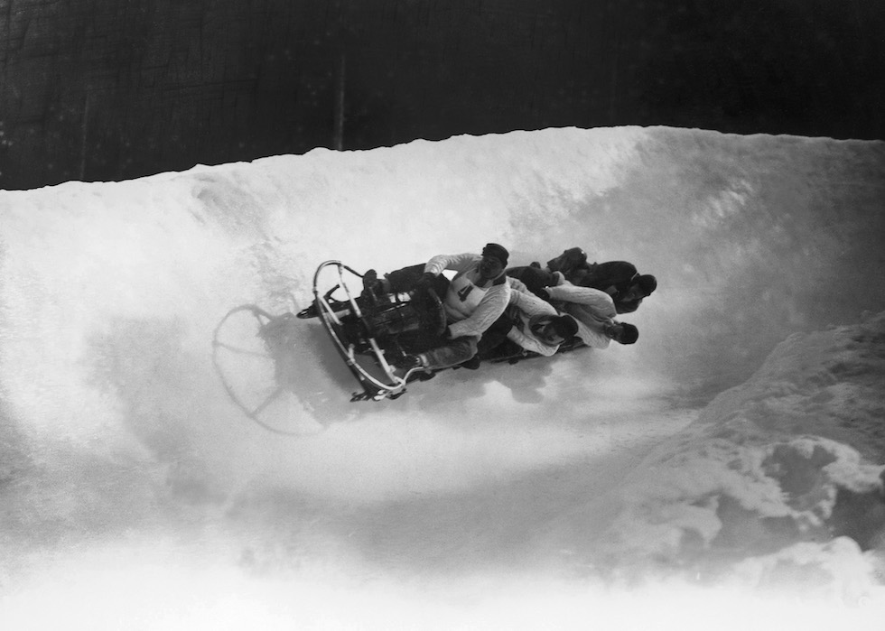
```

<!--chapter:end:01-Chamonix.Rmd-->

# II. Sankt Moritz 1928 {-}

```{r, echo=FALSE, out.width='40%', fig.cap='II edizione dei Giochi olimpici invernali'}
knitr::include_graphics("images/loghi/1928.jpg")
```

Si svolgono in Svizzera.

Dati:

* 25 nazioni
* 464 atleti
* 6 specialità:
  * bob 
  * hockey su ghiaccio
  * sci nordico
  * pattinaggio di figura
  * pattinaggio di velocità
  * skeleton

<!--chapter:end:02-SanktMoritz.Rmd-->

# III. Lake Placid 1932 {-}

```{r, echo=FALSE, out.width='40%', fig.cap='III edizione dei Giochi olimpici invernali'}
knitr::include_graphics("images/loghi/1932.jpg")
```

Si svolgono negli Stati Uniti, nello stato di New York.

Dati:

* 17 nazioni
* 252 atleti
* 7 specialità:
  * bob
  * hockey
  * pattinaggio di figura
  * pattinaggio di velocità
  * combinata nordica
  * salto con gli sci
  * sci di fondo

<!--chapter:end:03-LakePlacid.Rmd-->

# IV. Garmish-Partenkirchen 1936 {-}

```{r, echo=FALSE, out.width='40%', fig.cap='IV edizione dei Giochi olimpici invernali'}
knitr::include_graphics("images/loghi/1936.jpg")
```

Si svolgono in Germania.

Dati:

* 28 nazioni
* 646 atleti
* 8 specialità:
  * bob
  * hockey
  * pattinaggio di figura
  * pattinaggio di velocità
  * sci alpino
  * combinata nordica
  * salto con gli sci
  * sci di fondo

```{r, echo=FALSE, out.width='80%', fig.cap='Ivan Brown e Alan Washbond in una prova del bob maschile alle Olimpiadi di Garmisch-Partenkirchen del 1936. (Hulton Archive/Getty Images)'}
knitr::include_graphics("images/IlPost/1936.jpg")
```

<!--chapter:end:04-Garmish.Rmd-->

# V. Sankt Moritz 1948 {-}

```{r, echo=FALSE, out.width='40%', fig.cap='V edizione dei Giochi olimpici invernali'}
knitr::include_graphics("images/loghi/1948.png")
```

Si svolgono in Svizzera.

Dati:

* 28 nazioni
* 669 atleti
* 9 specialità:
  * bob
  * hockey
  * pattinaggio di figura
  * pattinaggio di velocità
  * sci alpino
  * combinata nordica
  * salto con gli sci
  * sci di fondo
  * skeleton

```{r, echo=FALSE, out.width='80%', fig.cap="Il pattinatore artistico americano Dick Button con l'attrice Paulette Goddard alle Olimpiadi invernali di Sankt Moritz, nel 1948. (Allsport Hulton/Archive)"}
knitr::include_graphics("images/IlPost/1948.jpg")
```

## Interruzione Seconda Guerra Mondiale {-}

L'edizione dei V Giochi olimpici invernali si sarebbe dovuta svolgere a Sapporo in Giappone nel febbraio del 1940.

La città giapponese venne scelta come organizzatrice dei Giochi il 9 giugno 1937. In seguito allo scoppio della Seconda guerra sino-giapponese, l'organizzazione venne riassegnata il 15 luglio 1938 a Sankt Moritz, che aveva già ospitato i II Giochi olimpici invernali.

In seguito a controversie sorte fra il comitato organizzatore svizzero ed il CIO, quest'ultimo decise per la seconda volta di riassegnare i Giochi il 9 giugno 1939: la scelta cadde su Garmisch, che aveva ospitato l'ultima edizione dei Giochi e che li avrebbe dunque organizzati di nuovo.

Lo scoppio della seconda guerra mondiale portò infine all'annullamento definitivo dei Giochi nel novembre del 1939.

Allo stesso modo venne annulata l'edizione del 1944 che avrebbe dovuto svolgersi a Cortina d'Ampezzo.

<!--chapter:end:05-SanktMoritz.Rmd-->

# VI. Oslo 1952 {-}

```{r, echo=FALSE, out.width='40%', fig.cap='VI edizione dei Giochi olimpici invernali'}
knitr::include_graphics("images/loghi/1952.png")
```

Si svolgono in Norvegia.

Dati:

* 30 nazioni
* 694 atleti
* 8 specialità:
  * bob
  * hockey
  * pattinaggio di figura
  * pattinaggio di velocità
  * sci alpino
  * salto con gli sci
  * sci di fondo
  * combinata nordica
  
```{r, echo=FALSE, out.width='80%', fig.cap='Il norvegese Brenden Hallgeir dopo aver vinto la prova di sci di fondo alle Olimpiadi di Oslo del 1952. (Allsport Hulton/Archive)'}
knitr::include_graphics("images/IlPost/1952.jpg")
```

```{r, echo=FALSE, out.width='80%', fig.cap="L'inglese Jeannette Altwegg si esibisce per i fotografi dopo aver vinto l'oro nel pattinaggio artistico alle Olimpiadi di Oslo del 1952. (Keystone/Getty Images)"}
knitr::include_graphics("images/IlPost/1952(2).jpg")
```

<!--chapter:end:06-Oslo.Rmd-->

# VII. Cortina d'Ampezzo 1956 {-}

```{r, echo=FALSE, out.width='40%', fig.cap='VII edizione dei Giochi olimpici invernali'}
knitr::include_graphics("images/loghi/1956.png")
```

Si svolgono in Italia.

Dati:

* 32 nazioni
* 821 atleti
* 8 specialità:
  * bob
  * hockey
  * pattinaggio di figura
  * pattinaggio di velocità
  * sci alpino
  * salto con gli sci
  * sci di fondo
  * combinata nordica
  
```{r, echo=FALSE, out.width='80%', fig.cap="La pista del pattinaggio su ghiaccio alle Olimpiadi invernali di Cortina d'Ampezzo del 1956. Nella foto l'atleta sovietico Boris Shilkov. (Keystone/Getty Images)"}
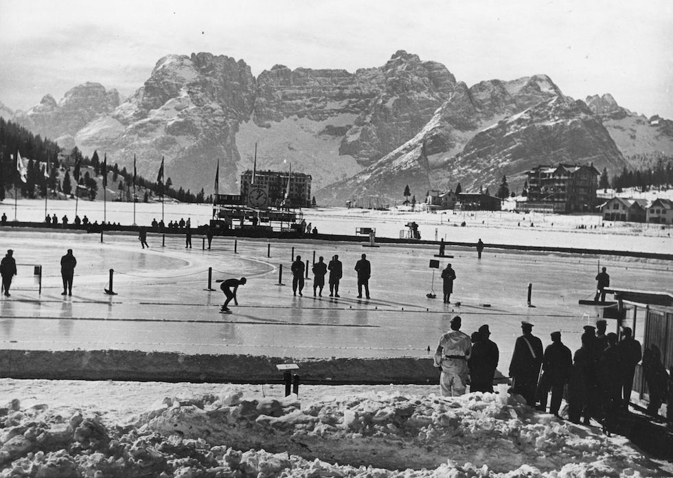
```

```{r, echo=FALSE, out.width='80%', fig.cap="Il generale Felice Porro, capo dell'aeronautica italiana, si congratula con alcuni atleti italiani in partenza per Cortina con la fiamma olimpica. (Keystone/Hulton Archive/Getty Images)"}
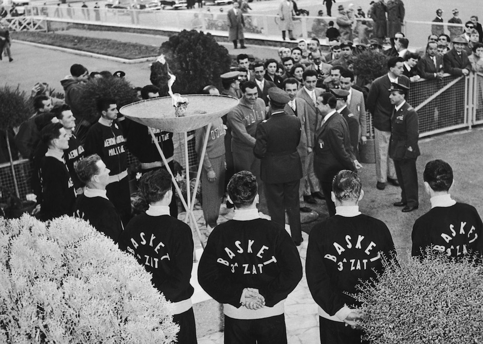
```

```{r, echo=FALSE, out.width='80%', fig.cap="Cortina 1956. I due concorrenti della squadra inglese di bob salutano dei passeggeri su una Bentley tra le strade di Cortina d’Ampezzo, il giorno prima della cerimonia di apertura delle Olimpiadi.(Artevitae)"}
knitr::include_graphics("images/ArteVitae/1956.jpg")
```

<!--chapter:end:07-Cortina.Rmd-->

# VIII. Squaw Valley 1960 {-}

```{r, echo=FALSE, out.width='40%', fig.cap='VIII edizione dei Giochi olimpici invernali'}
knitr::include_graphics("images/loghi/1960.png")
```

Si svolgono negli Stati Uniti

Dati:

* 30 nazioni
* 665 atleti
* 8 specialità:
  * biathlon
  * hockey
  * pattinaggio di figura
  * pattinaggio di velocità
  * sci alpino
  * salto con gli sci
  * sci di fondo
  * combinata nordica

```{r, echo=FALSE, out.width='80%', fig.cap='Due atleti nel corso di una sessione di pratica sulla pista di Squaw Valley, in California, nel 1960. (Hulton Archive/Getty Images)'}
knitr::include_graphics("images/IlPost/1960.jpg")
```

### Curiosità {-}

Nel 1960 si verificò alle Olimpiadi di Squaw Valley, negli Usa quello che fu ribattezzato "il miracolo dimenticato". La squadra di hockey americana riuscì a battere in finale i favoriti canadesi. Nella foto gli atleti statunitensi festeggiano la vittoria. Al centro s'intravede l'allenatore Jack Riley. 

```{r, echo=FALSE, out.width='80%', fig.cap='(Corriere della Sera)'}
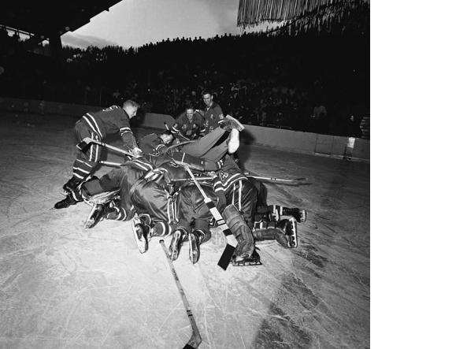
```

<!--chapter:end:08-SquawValley.Rmd-->

# IX. Innsbruck 1964 {-}

```{r, echo=FALSE, out.width='40%', fig.cap='IX edizione dei Giochi olimpici invernali'}
knitr::include_graphics("images/loghi/1964.png")
```

Si svolgono in Austria.

Dati:

* 36 nazioni
* 1091 atleti
* 10 specialità:
  * biathlon
  * bob
  * hockey
  * pattinaggio di figura
  * pattinaggio di velocità
  * sci alpino
  * salto con gli sci
  * sci di fondo
  * combinata nordica
  * slittino
  
```{r, echo=FALSE, out.width='80%', fig.cap='Innsbruck 1964. Il pattinatore americano Janice Smith con la faccia nella neve dopo aver finito la propria gara dei 1500 metri di pattinaggio.(Artevitae)'}
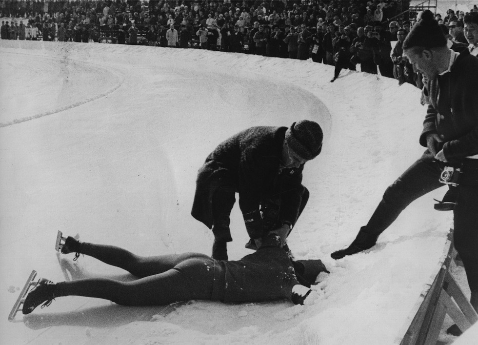
```

```{r, echo=FALSE, out.width='80%', fig.cap='Innsbruck 1964. Una foto dei circa 80mila spettatori che assisterono alla gara di salto con gli sci.'}
knitr::include_graphics("images/ArteVitae/1964(2).jpg")
```

<!--chapter:end:09-Innsbruck.Rmd-->

# X. Grenoble 1968 {-}

```{r, echo=FALSE, out.width='40%', fig.cap='X edizione dei Giochi olimpici invernali'}
knitr::include_graphics("images/loghi/1968.png")
```

Si svolgono in Francia.

Dati:

* 37 nazioni
* 1158 atleti
* 10 specialità:
  * biathlon
  * bob
  * combinata nordica
  * hockey
  * pattinaggio di figura
  * pattinaggio di velocità
  * sci alpino
  * salto con gli sci
  * sci di fondo
  * slittino

```{r, echo=FALSE, out.width='80%', fig.cap='Le statunitensi Mary Meyers, Dianne Holum e Jennifer Fish, terze classificate nel pattinaggio di velocità dopo aver fatto registrare lo stesso identico tempo, alle Olimpiadi invernali di Grenoble del 1968. (Allsport Hulton/Archive)'}
knitr::include_graphics("images/IlPost/1968.jpg")
```

```{r, echo=FALSE, out.width='80%', fig.cap="Grenoble 1968. Alcuni giocatori delle squadre di hockey della Cecoslovacchia e dell’URSS sono incastrati nella porta della Cecoslovacchia, durante una partita delle Olimpiadi.(Artevitae)"}
knitr::include_graphics("images/ArteVitae/1968.jpg")
```

### Curiosità {-}

Alle Olimpiadi del 1968 a Grenoble, in Francia, la squadra statunitense fu quasi esclusa dal medagliere olimpico. A salvarla dalla disfatta fu Peggy Flemming che vinse l'oro nel pattinaggio artistico. Fu la prima vittoria del team statunitense dal tragico incidente aereo di Sabena che nel 1961 uccise l'intera squadra di pattinaggio artistico americano.

```{r, echo=FALSE, out.width='80%', fig.cap='(Corriere della Sera)'}

```

Il francese Jean-Claude Killy, dominatore dello sci alpino negli anni '60 trionfò alle Olimpiadi di Grenoble nel 1968 dove vinse tre medaglie d'oro. A causa delle sue performance inimitabili fu soprannominato dai media americani "The Killympics". 

```{r, echo=FALSE, out.width='80%', fig.cap='(Corriere della Sera)'}

```

## Mascotte {-}

```{r, echo=FALSE, out.width='40%', fig.cap='Schuss'}
knitr::include_graphics("images/mascotte/Grenoble1968_mascotte.avif")
```

Shuss è un piccolo uomo sugli sci ideato da *Aline Lafargue*. Ufficialmente la prima mascotte ufficialmente riconosciuta dei Giochi olimpici.

Shuss è stato creato molto rapidamente. Nel gennaio 1967, il suo progettista aveva solo una notte per mettere a punto un piano per la presentazione.


Shuss era disponibile in una varietà di articoli: portachiavi, spille, magneti, orologi e persino in una versione gonfiabile.

<!--chapter:end:10-Grenoble.Rmd-->

# XI. Sapporo 1972 {-}

```{r, echo=FALSE, out.height='40%', fig.cap='XI edizione dei Giochi olimpici invernali'}
knitr::include_graphics("images/loghi/1972.jpg")
```

Si svolgono in Giappone.

Dati:

* 35 nazioni
* 1006 atleti
* 10 specialità:
  * biathlon
  * bob
  * combinata nordica
  * hockey
  * pattinaggio di figura
  * pattinaggio di velocità
  * sci alpino
  * salto con gli sci
  * sci di fondo
  * slittino

```{r, echo=FALSE, out.height='80%', fig.cap='Irina Rodnina e Alexei Ulanov, vincitori della prova in coppia di pattinaggio artistico, sul podio alle Olimpiadi di Sapporo del 1972. (STAFF/AFP/Getty Images)'}
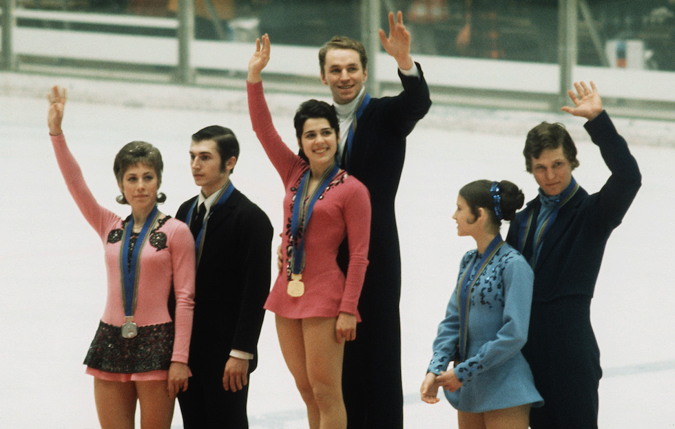
```

```{r, echo=FALSE, out.height='80%', fig.cap='Il pubblico festeggia gli sciatori svizzeri Bernhard Russi e Rolland Collombin dopo la discesa libera alle Olimpiadi di Sapporo del 1972. (STAFF/AFP/Getty Images)'}
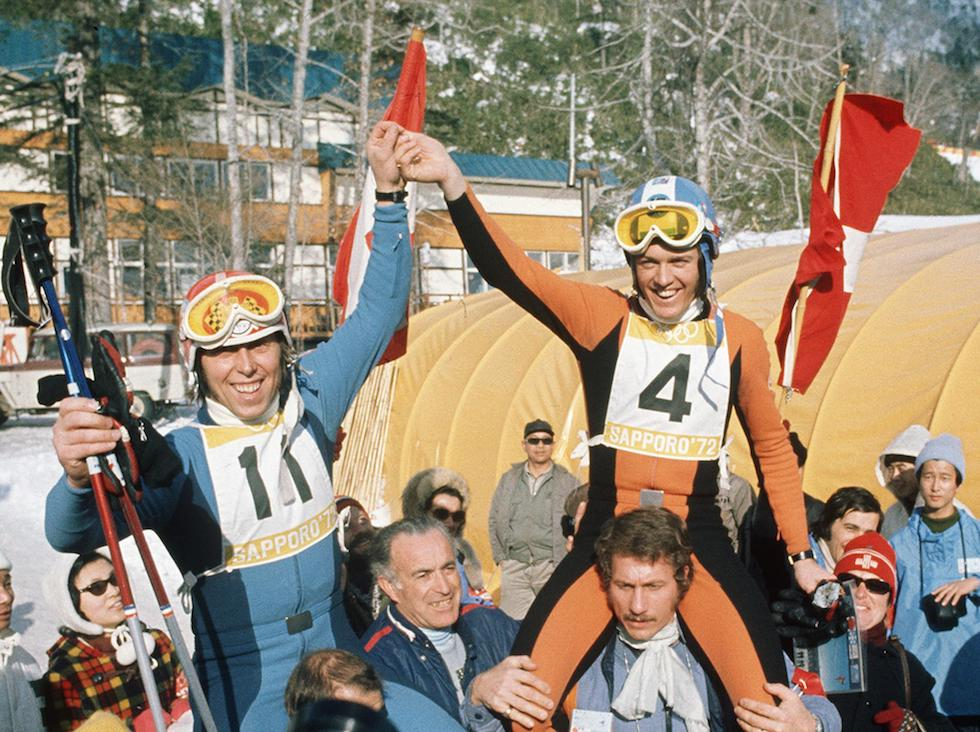
```

<!--chapter:end:11-Sapporo.Rmd-->

# XII. Innsbruck 1976 {-}

```{r, echo=FALSE, out.width='40%', fig.cap='XII edizione dei Giochi olimpici invernali'}
knitr::include_graphics("images/loghi/1976.png")
```

Si svolgono in Austria.

Dati:

* 37 nazioni
* 1123 atleti
* 10 specialità:
  * biathlon
  * bob
  * combinata nordica
  * hockey
  * pattinaggio di figura
  * pattinaggio di velocità
  * sci alpino
  * salto con gli sci
  * sci di fondo
  * slittino
  
```{r, echo=FALSE, out.width='80%', fig.cap='La sciatrice tedesca Rosie Mittermaier nello slalom alle Olimpiadi di Innsbruck del 1976. (Tony Duffy/Allsport)'}
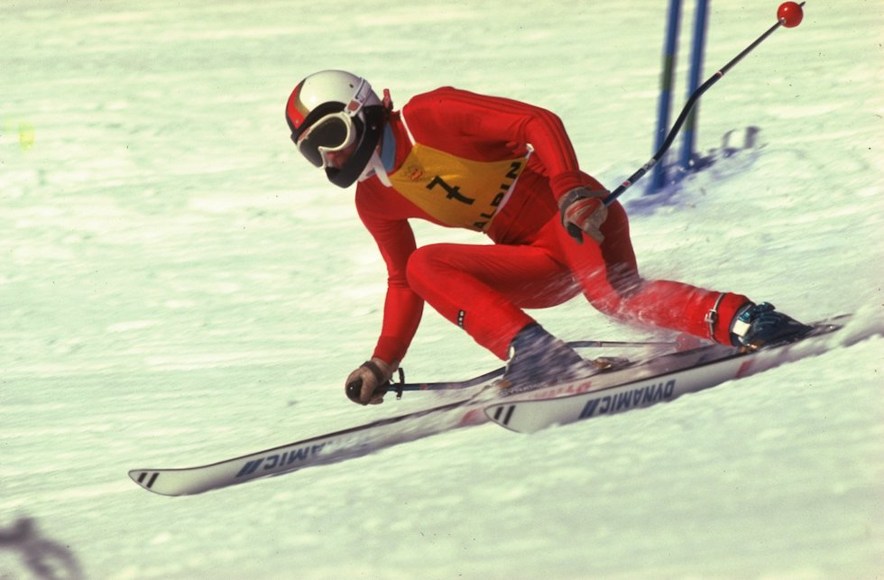
```

```{r, echo=FALSE, out.width='80%', fig.cap="Insbruck 1976. Lo sciatore italiano Piero Gros dopo aver vinto la medaglia d’oro dello slalom. (Artevitae)"}
knitr::include_graphics("images/ArteVitae/1976.jpg")
```

## Mascotte {-}

```{r, echo=FALSE, out.width='40%', fig.cap='Schneemann'}
knitr::include_graphics("images/mascotte/Innsbruck1976_mascotte.avif")
```

Il nome significa "pupazzo di neve" in tedesco. Schneemann è stato ideato da *Walter Potsch* e indossa un cappello rosso tirolese tipico della regione di Innsbruck.

Schneemann si è rivelato un vero successo commerciale. Sono state create magliette, peluche, oggetti promozionali e le persone hanno iniziato a usare grandi costumi diventando "mascotte viventi" per eventi promozionali.

<!--chapter:end:12-Innsbruck.Rmd-->

# XIII. Lake Placid 1980 {-}

```{r, echo=FALSE, out.width='40%', fig.cap='XIII edizione dei Giochi olimpici invernali'}
knitr::include_graphics("images/loghi/1980.png")
```

Si svolgono negli Stati Uniti, nello stato di New York.

Dati:

* 37 nazioni
* 1072 atleti
* 10 specialità:
  * biathlon
  * bob
  * combinata nordica
  * hockey
  * pattinaggio di figura
  * pattinaggio di velocità
  * sci alpino
  * salto con gli sci
  * sci di fondo
  * slittino

```{r, echo=FALSE, out.width='80%', fig.cap='Lo statunitense Mike Ramsey e il russo Valeri Kharlamov durante la storica partita tra Stati Uniti e Unione Sovietica nel torneo olimpico di hockey a Lake Placid, nel 1980. (Tony Duffy/Getty Images)'}
knitr::include_graphics("images/IlPost/1980.jpg")
```

### Curiosità {-}

"Miracolo sul ghiaccio" è l'appellativo usato negli Stati Uniti per indicare la partita di hockey tra Usa e Urss nei XIII Giochi olimpici invernali, disputati a Lake Placid nel 1980. Il team statunitense, composto da dilettanti e giocatori universitari, sconfisse i favoritissimi russi e successivamente avrebbe conquistato un'improbabile medaglia d'oro. Un film che ricorda l'evento, dal titolo "Miracle On Ice", andò in onda alla televisione americana nel 1981 e venne distribuito nei cinema nel 1989.

```{r, echo=FALSE, out.width='80%', fig.cap='(Corriere della Sera)'}
knitr::include_graphics("images/corriere/1980.jpg")
```

## Mascotte {-}

```{r, echo=FALSE, out.width='40%', fig.cap='Roni'}
knitr::include_graphics("images/mascotte/LakePlacid1980_mascotte.avif")
```

Il nome Roni è stato scelto dai bambini delle scuole di Lake Placid, e deriva dalla parola "procione" in irochese, la lingua dei nativi della regione nello Stato di New York e Lake Placid.

Il procione è un animale abituale nella regione montuosa degli Adirondacks, dove si trova Lake Placid. I tratti del viso del procione e la colorazione bianca e nera intorno agli occhi sono un riferimento agli occhiali da sole e al cappello indossati da alcuni dei concorrenti.

Per promuovere i Giochi, il Comitato Organizzatore ha fatto ricorso anche all'uso di veri procioni: due esemplari dello zoo di Utica sono stati portati a New York per prendere parte allo spettacolo.

La mascotte è stata ideata da *Don Moss, Capital Sports*.

<!--chapter:end:13-LakePlacid.Rmd-->

# XIV. Sarajevo 1984 {-}

```{r, echo=FALSE, out.width='40%', fig.cap='XIV edizione dei Giochi olimpici invernali'}
knitr::include_graphics("images/loghi/1984.png")
```

Si svolgono in Jugoslavia, nella capitale attuale della Bosnia-Erzegovina.

Dati:

* 49 nazioni
* 1272 atleti
* 10 specialità:
  * biathlon
  * bob
  * combinata nordica
  * hockey
  * pattinaggio di figura
  * pattinaggio di velocità
  * sci alpino
  * salto con gli sci
  * sci di fondo
  * slittino

## Mascotte {-}

```{r, echo=FALSE, out.width='40%', fig.cap='Vuč ko'}
knitr::include_graphics("images/mascotte/Sarajevo1984_mascotte.avif")
```

Vučko è stato creato da *Jože Trobec*. 
ha la forma di un lupo, animale tipico delle foreste delle Alpi Dinariche. Attraverso le sue espressioni facciali sorridenti, spaventate o serie, Vučko ha regalato al lupo un aspetto piuttosto amichevole contribuendo a cambiare l'immagine solitamente feroce di questo animale.

La mascotte viene scelta con una competizione a cui partecipano 836 persone. Dopo una selezione iniziale, vengono scelti sei progetti, che poi partecipano a una votazione su giornali e riviste. È il lupo del pittore sloveno Trobec a trionfare agevolmente sugli avversari: una palla di neve, un caprone di montagna, una donnola, un agnello e un riccio.

Il lupo è una figura di primo piano nelle favole jugoslave: rappresenta coraggio e forza, e simbolizza l'inverno.

Vučko era un personaggio creato da Nedeljko Dragic e pubblicato su diversi giornali e riviste in Jugoslavia.


<!--chapter:end:14-Sarajevo.Rmd-->

# XV. Calgary 1988 {-}

```{r, echo=FALSE, out.width='40%', fig.cap='XV edizione dei Giochi olimpici invernali'}
knitr::include_graphics("images/loghi/1988.png")
```

Si svolgono in Canada.

Dati:

* 57 nazioni
* 1423 atleti
* 10 specialità:
  * biathlon
  * bob
  * combinata nordica
  * hockey
  * pattinaggio di figura
  * pattinaggio di velocità
  * sci alpino
  * salto con gli sci
  * sci di fondo
  * slittino
  
```{r, echo=FALSE, out.width='80%', fig.cap='La statunitense Erica Terwillegar nella prova di slittino alle Olimpiadi invernali di Calgary del 1988. (Allsport UK /Allsport)'}

```

```{r, echo=FALSE, out.width='80%', fig.cap="Calgary 1988. Un pattinatore svedese cade mentre uno dell’Unione Sovietica lo supera durante una gara dei 1500 metri di pattinaggio. (Artevitae)"}
knitr::include_graphics("images/ArteVitae/1988.jpg")
```

### Curiosità {-}

Alle Olimpiadi di Calgary in Canada il pubblico assistette alla "battaglia dei Brian", la grande rivalità nel pattinaggio artistico tra l'americano Brian Boitano e il canadese Brian Orser. Entrambi portarono a termine performance incredibili, ma alla fine Boitano vinse l'oro per un decimo di punto.

```{r, echo=FALSE, out.width='80%', fig.cap='(Corriere della Sera)'}
knitr::include_graphics("images/corriere/1988.jpg")
```

## Mascotte {-}

```{r, echo=FALSE, out.width='40%', fig.cap='Hidy e Howdy'}
knitr::include_graphics("images/mascotte/Calgary1988_mascotte.avif")
```

I nomi delle mascotte rappresentano l'ospitalità della regione di Calgary. Quindi “Hidy” è un'estensione di “hi”, e “Howdy” di “how do you do”, espressione tipica dell'America occidentale. Nomi scelti da una giuria di cittadini, dopo una competizione organizzata dallo zoo di Calgary che attirò oltre 7.000 partecipanti.

Hidy e Howdy sono orsi polari, simbolici della regione artica a nord del continente americano. Hanno cappelli e vestiti da cowboy, creati da *Sheila Scott* (Great Scott Productions).

Howdy e sua sorella Hidy sono la prima coppia di mascotte.

<!--chapter:end:15-Calgary.Rmd-->

# XVI. Albertville 1992 {-}

```{r, echo=FALSE, out.width='40%', fig.cap='XVI edizione dei Giochi olimpici invernali'}
knitr::include_graphics("images/loghi/1992.png")
```

Si svolgono in Francia.

Dati:

* 64 nazioni
* 1801 atleti
* 12 specialità:
  * biathlon
  * bob
  * combinata nordica
  * freestyle
  * hockey
  * pattinaggio di figura
  * pattinaggio di velocità
  * sci alpino
  * salto con gli sci
  * sci di fondo
  * short track
  * slittino
  
```{r, echo=FALSE, out.width='80%', fig.cap='La vista dalle tribune della pista di bob delle Olimpiadi di Albertville del 1992. (Pascal Rondeau/Allsport)'}
knitr::include_graphics("images/IlPost/1992.jpg")
``` 

```{r, echo=FALSE, out.width='80%', fig.cap="La medaglia d'oro delle Olimpiadi di Albertville. (Getty Images)"}
knitr::include_graphics("images/IlPost/1992(2).jpg")
``` 

```{r, echo=FALSE, out.width='80%', fig.cap="Il norvegese Johann Olav Koss nella prova di pattinaggio di velocità alle Olimpiadi di Albertville del 1992, dove vincerà la medaglia d'oro. (Getty Images)"}

``` 

## Mascotte {-}

```{r, echo=FALSE, out.width='40%', fig.cap='Magique'}
knitr::include_graphics("images/mascotte/Albertville1992_mascotte.avif")
```

Un piccolo bambino a forma di stella e un cubo, Magique è la prima mascotte non animale dai Giochi di Innsbruck 1976. La forma di stella simbolizza sogni e immaginazione. I colori provengono dalla bandiera francese.

Ideata da *Philippe Mairesse*, ci sono voluti diversi studi finanziati dal Comitato Organizzatore (OCOG) per trovare un nome alla mascotte senza però riuscirci. Rileggendo i suoi appunti, il creatore capisce che la parola “magico” ricorre spesso. Con entusiasmo l'OCOG decide di chiamare così la mascotte.

Originariamente, la mascotte era un caprone di montagna creato dall'illustratore Michel Pirus. L'idea di un bambino a forma di stella nasce due anni prima dei Giochi.

La mascotte aveva uno scopo pedagogico: per formare i 7.924 volontari dei Giochi, l'OCOG crea un programma educativo di informatica in cui Magique appare in diversi moduli di insegnamento e nei giochi.

<!--chapter:end:16-Albertville.Rmd-->

# XVII. Lillehammer 1994 {-}

```{r, echo=FALSE, out.width='40%', fig.cap='XVII edizione dei Giochi olimpici invernali'}
knitr::include_graphics("images/loghi/1994.png")
```

Si svolgono in Norvegia.

Dati:

* 67 nazioni
* 1739 atleti
* 12 specialità:
  * biathlon
  * bob
  * combinata nordica
  * freestyle
  * hockey
  * pattinaggio di figura
  * pattinaggio di velocità
  * sci alpino
  * salto con gli sci
  * sci di fondo
  * short track
  * slittino

```{r, echo=FALSE, out.width='80%', fig.cap='Il saltatore norvegese Stein Gruben si prepara a percorrere un tratto di discesa con la torcia olimpica nella cerimonia inaugurale delle Olimpiadi di Lillehammer del 1994. (Bob Martin/ALLSPORT)'}
knitr::include_graphics("images/IlPost/1994.jpg")
```

```{r, echo=FALSE, out.width='80%', fig.cap='Il norvegese Bjorn Daehlie fra il pubblico nella 15 chilometri di fondo alle Olimpiadi del 1994 di Lillehammer. (Clive Brunskill/ALLSPORT)'}
knitr::include_graphics("images/IlPost/1994(2).jpg")
```

###Curiosità {-}

La più grande rivalità dei Giochi del 1994 a Lillehammer, in Norvegia, fu tra le pattinatrici americane Tonya Harding (a destra) e Nancy Kerrigan (a sinistra). Un mese prima della rassegna olimpica, l'ex marito di Harding colpì a un ginocchio con un manganello della polizia Kerrigan sulle ginocchia per tenerla fuori dai Giochi. Nonostante ciò Kerrigan riuscì a vincere la medaglia d'argento, mentre la rivale finì solo ottava. 

```{r, echo=FALSE, out.width='80%', fig.cap='(Corriere della Sera)'}
knitr::include_graphics("images/corriere/1994.jpg")
```

## Mascotte {-}

```{r, echo=FALSE, out.width='40%', fig.cap='Haakon e Kristin'}
knitr::include_graphics("images/mascotte/Lillehammer1994_mascotte.avif")
```

I nomi delle mascotte, create da *Kari e Werner Grossman*, su un'idea di *Javier Ramirez Campuzano*, si riferiscono a personaggi storici del 13° secolo, il cui destino è strettamente legato alla Norvegia e alla regione di Lillehammer: Håkon IV Håkonson, re di Norvegia dal 1217 al 1263, e la principessa Kristin, sua zia.

I due bambini felici sono le prime mascotte in forma umana. Anche se indossano abiti medievali in riferimento alle loro radici storiche, sono bambini moderni ed esprimono gli interessi e le visioni dei giovani, come la consapevolezza ambientale.

Due piste di pattinaggio situate una accanto all'altra e che portano i nomi delle mascotte hanno ospitato gli eventi Olimpici e Paralimpici del 1994: la Hakons Hall e la Kristins Hall.

Le figure storiche che hanno ispirato le mascotte sono vissute durante un periodo travagliato in Norvegia dove due tribù, i Birkebeiner e i Bagler, combattevano per il potere. Anche se era solo un bambino, Håkon Håkonson, minacciato dai Baglers, dovette fuggire da Lillehammer attraverso le montagne con i suoi fedeli. La principessa Birkebeiner Kristin Sverrisdóttir sposò il capo dei Baglers, Filippus Símonsson, per portare la pace tra le due fazioni.

<!--chapter:end:17-Lillehammer.Rmd-->

# XVIII. Nagano 1998 {-}

```{r, echo=FALSE, out.width='40%', fig.cap='XVIII edizione dei Giochi olimpici invernali'}
knitr::include_graphics("images/loghi/1998.png")
```

Si svolgono in Giappone.

Dati:

* 72 nazioni
* 2302 atleti
* 14 specialità:
  * biathlon
  * bob
  * combinata nordica
  * curling
  * freestyle
  * hockey
  * pattinaggio di figura
  * pattinaggio di velocità
  * sci alpino
  * salto con gli sci
  * sci di fondo
  * short track
  * slittino
  * snowboard
  
```{r, echo=FALSE, out.width='80%', fig.cap='I pattinatori francesi Marina Anissina e Gwendal Peizerat nella loro esibizione alle Olimpiadi invernali del 1998 a Nagano. (Clive Brunskill /Allsport)'}
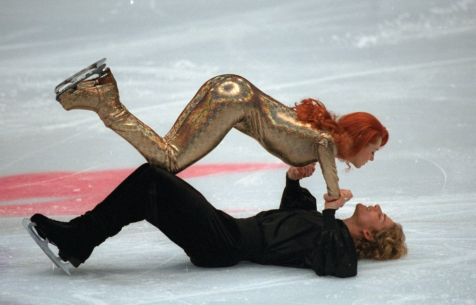
```

```{r, echo=FALSE, out.width='80%', fig.cap='Alberto Tomba nello slalom gigante di Shiga Kogen alle Olimpiadi invernali di Nagano del 1998. (Clive Brunskill /Allsport)'}
knitr::include_graphics("images/IlPost/1998(2).jpg")
```

### Curiosità {-}

Le Olimpiadi Invernali del 1998 a Nagano, in Giappone, furono le prime a presentare gare di snowboard. Il canadese Ross Rebagliati conquistò la medaglia d'oro olimpica nello snowboard - slalom gigante. 

```{r, echo=FALSE, out.width='80%', fig.cap='(Corriere della Sera'}
knitr::include_graphics("images/corriere/1998.jpg")
```

## Mascotte {-}

```{r, echo=FALSE, out.width='40%', fig.cap='Sukki, Nokki, Lekki e Tsukki'}
knitr::include_graphics("images/mascotte/Nagano1998_mascotte.avif")
```

I gufi Sukki, Nokki, Lekki e Tsukki sono anche noti come gli Snowlets. “Snow” – neve – si riferisce alla stagione invernale in cui si disputano i Giochi, “lets” si riferisce a “let’s”, un invito a partecipare alla festa Olimpica. Inoltre, le prime due lettere dei nomi messe insieme formano “snowlets”. “Owlets” significa giovani gufi.

Ideati da *Landor Associates*, Sukki, Nokki, Lekki e Tsukki sono quattro gufi della neve. Rappresentano, rispettivamente, fuoco (Sukki), aria (Nokki), terra (Lekki) e acqua (Tsukki). La scelta delle quattro mascotte è legata ai quattro anni che separano le Olimpiadi.

Originariamente, la mascotte dei Giochi di Nagano doveva essere una donnola di nome “Snowple”.

I gufi vengono venerati nel mondo, considerati i “saggi del bosco”; nella mitologia greca il gufo è associato ad Atena, la dea della saggezza.

I nomi dei quattro Snowlets scelti tra 47.484 suggerimenti.

<!--chapter:end:18-Nagano.Rmd-->

# XIX. Salt Lake City 2002 {-}

```{r, echo=FALSE, out.width='40%', fig.cap='XIX edizione dei Giochi olimpici invernali'}
knitr::include_graphics("images/loghi/2002.png")
```

Si svolgono negli Stati Uniti, nella capitale dello Utah.

Dati:

* 77 nazioni
* 2399 atleti
* 15 specialità:
  * biathlon
  * bob
  * combinata nordica
  * curling
  * freestyle
  * hockey
  * pattinaggio di figura
  * pattinaggio di velocità
  * sci alpino
  * salto con gli sci
  * sci di fondo
  * short track
  * skeleton
  * slittino
  * snowboard

```{r, echo=FALSE, out.width='80%', fig.cap="L'estone Andrus Veerpalu nella gara di sci di fondo a Salt Lake City nel 2002. (Zoom Agence/Getty Images)"}
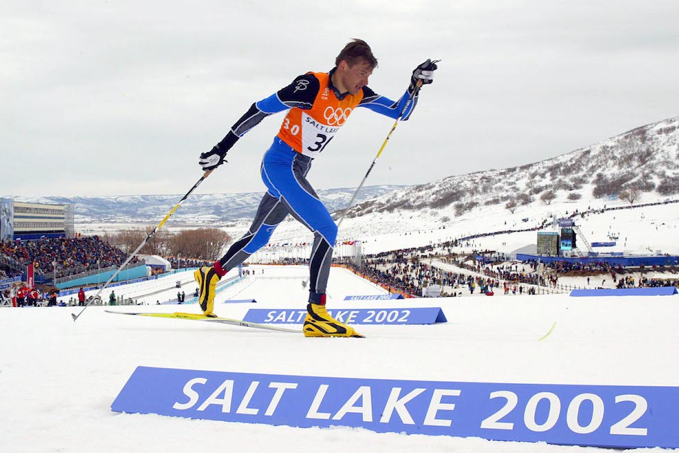
```

```{r, echo=FALSE, out.width='80%', fig.cap="Una foto scattata allo Utah Olympic Park di Park City durante la prova di salto con gli sci alle Olimpiadi di Salt Lake City. (Jed Jacobsohn /Getty Images)"}
knitr::include_graphics("images/IlPost/2002(2).jpg")
```

```{r, echo=FALSE, out.width='80%', fig.cap='La squadra statunitense del bob alle Olimpiadi di Salt Lake City del 2002. (Getty Images)'}
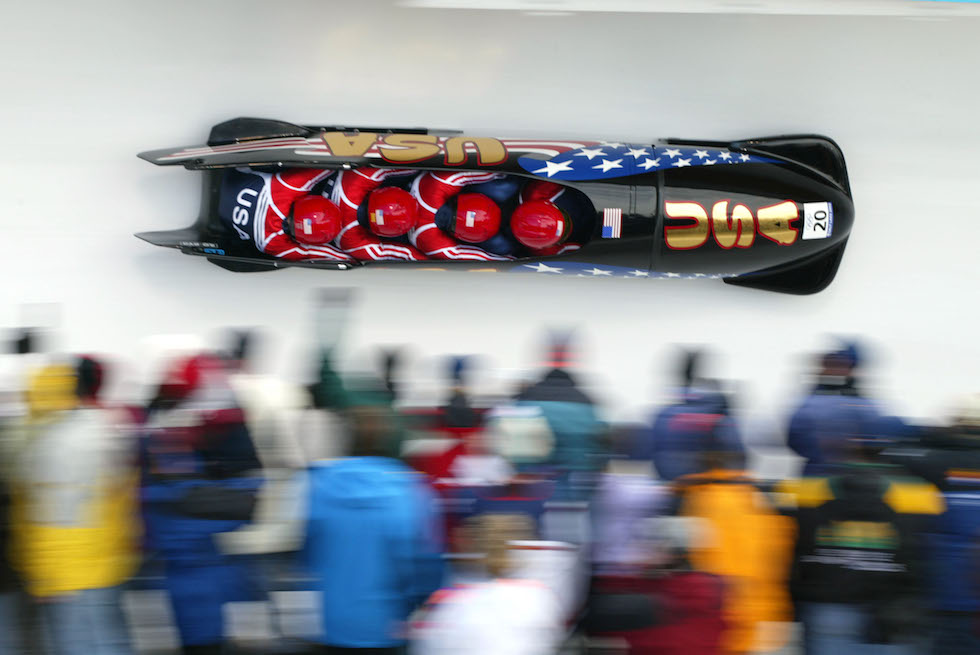
```

### Curiosità {-}

Alle Olimpiadi del 2002 a Salt Lake City, Jim Shea, skeletonista statunitense, conquista l'oro e diventa un campione olimpico di terza generazione. Suo padre infatti aveva gareggiato in gare di sci di fondo, mentre suo nonno era Jack Shea, il famoso pattinatore olimpico, vincitore di due medaglie d'oro ai Giochi di Lake Placid del 1932. 

```{r, echo=FALSE, out.width='80%', fig.cap='(Corriere della Sera'}
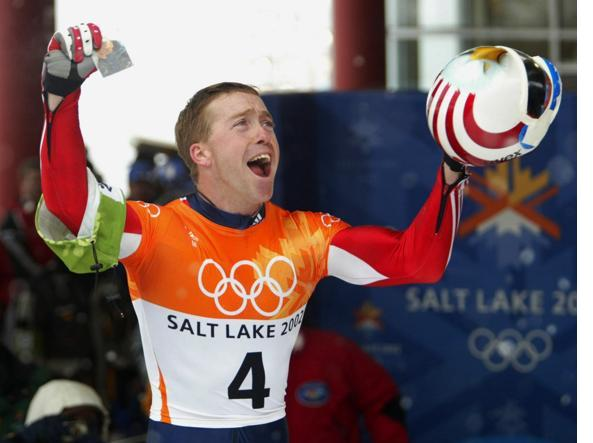
```
Nel 2002, la squadra femminile di curling britannica ha portato a casa il primo oro olimpico in 18 anni di competizioni. Il team era composto da "casalinghe superstar" come furono ribattezzate le atlete sulle prime pagine dei tabloid d'Oltremanica.

```{r, echo=FALSE, out.width='80%', fig.cap='(Corriere della Sera'}
knitr::include_graphics("images/corriere/2002(2).jpg")
```
Nel 2002, il pattinatore Steven Bradbury ha vinto il primo oro olimpico invernale dell'Australia nella storia, dopo che tutti gli avversari sono caduti nel tratto finale della gara. Da allora nel Paese anglofono l'espressione "doing a Bradbury" (fare un Bradbury) è sinonimo di "successo clamoroso e altamente insperato". 
```{r, echo=FALSE, out.width='80%', fig.cap='(Corriere della Sera'}
knitr::include_graphics("images/corriere/2002(3).jpg")
```

## Mascotte {-}

```{r, echo=FALSE, out.width='40%', fig.cap='Powder, Coal e Copper'}
knitr::include_graphics("images/mascotte/SaltLakeCity2002_mascotte.avif")
```

I nomi Powder (polvere), Coal (carbone) e Copper (rame) sono un'allusione alla neve, alle risorse naturali e alla terra dello Utah. 
Ideati da *Landor/Publicis* a partire da consigli arrivati da oltre 42.000 studenti. Il Comitato Organizzatore lancia una competizione nazionale per decidere i nomi. Altre opzioni erano: Sky, Cliff, Shadow, Arrow, Bolt e Rocky.

Powder è una lepre con racchette da neve, Copper è un coyote e Coal un orso bruno. La velocità della lepre, la capacità di arrampicarsi del coyote e la forza dell'orso rappresentano il motto Olimpico "*Citius, Altius, Fortius"* (più veloce, più in alto, più forte). L'ispirazione viene dall'antica cultura dello Utah.
Ognuno dei tre indossa una collana con la forma dell'animale che rappresenta, disegnato come le incisioni rupestri nello stile degli Anasazis o dei Fremonts, antiche popolazioni della regione. Inoltre, i tre animali erano spesso protagonisti delle antiche leggende americane, passate di generazione in generazione.

<!--chapter:end:19-SaltLake.Rmd-->

# XX. Torino 2006 {-}

```{r, echo=FALSE, out.width='40%', fig.cap='XX edizione dei Giochi olimpici invernali'}
knitr::include_graphics("images/loghi/2006.png")
```

Si svolgono in Italia.

Dati:

* 80 nazioni
* 2633 atleti
* 15 specialità:
  * biathlon
  * bob
  * combinata nordica
  * curling
  * freestyle
  * hockey
  * pattinaggio di figura
  * pattinaggio di velocità
  * sci alpino
  * salto con gli sci
  * sci di fondo
  * short track
  * skeleton
  * slittino
  * snowboard

```{r, echo=FALSE, out.width='80%', fig.cap='Il georgiano Iason Abramashvili nello slalom gigante alle Olimpiadi di Torino del 2006. (Donald Miralle/Getty Images)'}
knitr::include_graphics("images/IlPost/2006.jpg")
```

```{r, echo=FALSE, out.width='80%', fig.cap='Il norvegese Ole Einar Bjoerndalen nella gara di biathlon alle Olimpiadi di Torino del 2006. (Donald Miralle/Getty Images)'}
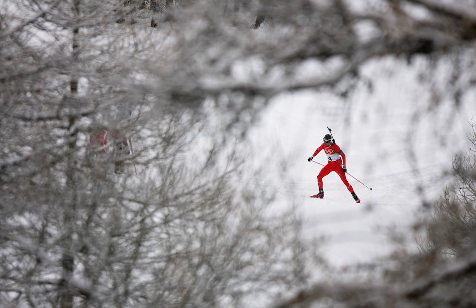
```

## Mascotte {-}

```{r, echo=FALSE, out.width='40%', fig.cap='Neve e Gliz'}
knitr::include_graphics("images/mascotte/Torino2006_mascotte.avif")
```

Creati da *Pedro Albuquerque*, Neve è una palla di neve, Gliz è un cubo di ghiaccio. 
Insieme, formano gli elementi necessari per i Giochi Invernali e rappresentano gli sport invernali.

Neve, vestita di rosso con contorni fluidi e rotondi, rappresenta l'armonia e l'eleganza dei movimenti.
La forma spigolosa di Gliz, vestito di blu, richiama invece la potenza e la forza degli atleti.

La creazione delle mascotte arriva da una gara internazionale lanciata tre anni prima dei Giochi. La gara era aperta ad agenzie di design-pubblicità e grafica oltre che a designer indipendenti. Cinque i finalisti selezionati tra le 237 proposte arrivate: il vincitore è stato un designer portoghese, scelto dall'ufficio presidenziale del comitato organizzatore.

Un cartone animato di 52 episodi da un minuto con Neve e Gliz protagonisti è stato trasmesso dai canali TV italiani RAI 2 e RAI 3, dall'ottobre del 2005 al febbraio del 2006. Ogni episodio copre aspetti delle Olimpiadi: valori, territorio, sport, etc.

<!--chapter:end:20-Torino.Rmd-->

# XXI. Vancouver 2010 {-}

```{r, echo=FALSE, out.width='40%', fig.cap='XXI edizione dei Giochi olimpici invernali'}
knitr::include_graphics("images/loghi/2010.png")
```

Si svolgono in Canada.

Dati:

* 82 nazioni
* 2622 atleti
* 15 specialità:
  * biathlon
  * bob
  * combinata nordica
  * curling
  * freestyle
  * hockey
  * pattinaggio di figura
  * pattinaggio di velocità
  * sci alpino
  * salto con gli sci
  * sci di fondo
  * short track
  * skeleton
  * slittino
  * snowboard

```{r, echo=FALSE, out.width='80%', fig.cap='La statunitense Hannah Kearney nella prova di freestyle femminile alle Olimpiadi di Vancouver del 2010. (Streeter Lecka/Getty Images)'}

```

```{r, echo=FALSE, out.width='80%', fig.cap='Il braciere olimpico delle Olimpiadi di Vancouver del 2010. (Getty Images)'}
knitr::include_graphics("images/IlPost/2010(2).jpg")
```

## Mascotte {-}

```{r, echo=FALSE, out.width='40%', fig.cap='Quatchi e Miga'}
knitr::include_graphics("images/mascotte/Vancouver2010_mascotte.avif")
```

Le mascotte dei Giochi di Vancouver sono creature ispirate alla fauna e ai racconti delle Prime Nazioni native sulla costa occidentale del Canada.

Quatchi è uno "sasquatch", un personaggio popolare delle leggende locali che vive nella foresta. È coperto da una folta pelliccia e indossa stivali e paraorecchie.

Miga è un orso marino, un animale mitico che è in parte orca e in parte orso Kermode. L'orso Kermode, chiamato anche "Orso Spirito", vive solo nella British Columbia.

Il Comitato Organizzatore ha lanciato una gara d'appalto tra agenzie d'illustrazione e professionisti, a cui hanno risposto in 177. Cinque disegnatori sono stati selezionati per mettere in atto uno studio più dettagliato delle proposte: alla fine, è stato *Meomi design* a vincere.

```{r, echo=FALSE, out.width='40%', fig.cap='Quatchi e Miga'}
knitr::include_graphics("images/mascotte/mukmuk.png")
```

Quatchi e Miga hanno un amico chiamato "Mukmuk", che si è rivelato molto popolare, anche se non è una mascotte ufficiale. Mukmuk è stato ispirato da un raro tipo di marmotta, in pericolo di estinzione, che vive solamente su un'isola nei pressi di Vancouver. Il suo nome deriva dalla parola "muckamuck", che significa "cibo" in Chinook. Sebbene all'inizio esistesse solo virtualmente e sulla carta, in seguito è stato riprodotto in una gamma di prodotti.

<!--chapter:end:21-Vancouver.Rmd-->

# XXII. Sochi 2014 {-}

```{r, echo=FALSE, out.width='40%', fig.cap='XXII edizione dei Giochi olimpici invernali'}
knitr::include_graphics("images/loghi/2014.png")
```

Si svolgono in Russia.

Dati:

* 88 nazioni
* 2860 atleti
* 15 specialità:
  * biathlon
  * bob
  * combinata nordica
  * curling
  * freestyle
  * hockey
  * pattinaggio di figura
  * pattinaggio di velocità
  * sci alpino
  * salto con gli sci
  * sci di fondo
  * short track
  * skeleton
  * slittino
  * snowboard
  
```{r, echo=FALSE, out.width='80%', fig.cap="L'australiano David Morris nelle finali del freestyle maschile alle Olimpiadi di Sochi del 2014. (Cameron Spencer/Getty Images)"}

```

```{r, echo=FALSE, out.width='80%', fig.cap="L'austriaco Wolfgang Kindl nella prova di slittino alle Olimpiadi di Sochi del 2014. (Alex Livesey/Getty Images)"}
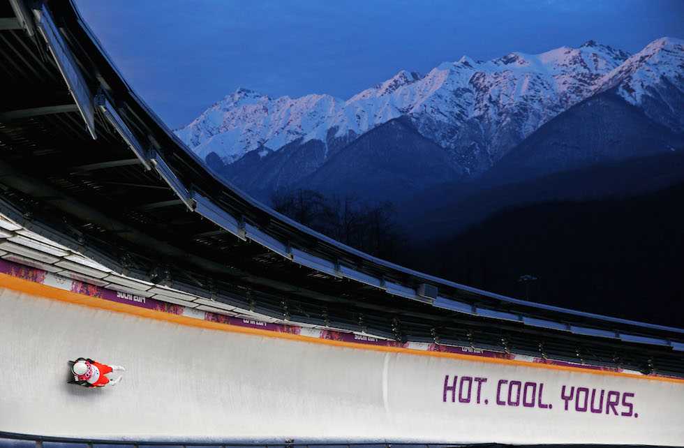
```

```{r, echo=FALSE, out.width='80%', fig.cap="La Nazionale di hockey russa prima della partita contro la Svizzera alle Olimpiadi di Sochi del 2014. (Martin Rose/Getty Images)"}

```

### Curiosità {-}

Grandi polemiche ai Giochi di Sochi, nel 2014. La pattinatrice russa Adelina Sotnikova vince la medaglia d'oro nella gara individuale femminile, ma secondo gli osservatori la sua performance era nettamente inferiore rispetto alla prestazione della sudcoreana Yuna Kim. Non pochi hanno accusato i giudici di aver favorito l'atleta casalinga. 

```{r, echo=FALSE, out.width='80%', fig.cap="(Corriere della Sera)"}

```

## Mascotte {-}

```{r, echo=FALSE, out.width='40%', fig.cap="La lepre, l'orso polare e il leopardo"}
knitr::include_graphics("images/mascotte/Sochi2014_mascotte.avif")
```

Tre mascotte che rappresentano i tre piazzamenti sul podio Olimpico.
Creatori: *Silviya Petrova* (lepre), *Oleg Seredechniy* (orso polare) e *Vadim Pak* (leopardo).

Le mascotte per i Giochi Olimpici sono state scelte dopo un concorso che si è svolto prima in tutta la Russia, poi a livello internazionale. In totale sono stati presentati 24.048 disegni. Dieci proposte sono state scelte da una giuria di esperti per la seconda fase del concorso: i designer professionisti hanno quindi lavorato su di loro per mettere a punto la forma definitiva. La decisione finale è stata presa con una votazione del pubblico russo nell'ambito di un programma televisivo intitolato "Talismaniya Sochi 2014 – La finale" il 26 febbraio 2011.

Nel 2012, la Russia ha introdotto una nuova moneta da 25 rubli e le mascotte di Sochi 2014 hanno avuto l'onore di essere presenti su questa moneta.

<!--chapter:end:22-Sochi.Rmd-->

# XXIII. Pyeongchang 2018 {-}

```{r, echo=FALSE, out.width='40%', fig.cap='XXIII edizione dei Giochi olimpici invernali'}
knitr::include_graphics("images/loghi/2018.png")
```

Si svolgono in Corea del Sud.

Dati:

* 92 nazioni
* 2920 atleti
* 15 specialità:
  * biathlon
  * bob
  * combinata nordica
  * curling
  * freestyle
  * hockey
  * pattinaggio di figura
  * pattinaggio di velocità
  * sci alpino
  * salto con gli sci
  * sci di fondo
  * short track
  * skeleton
  * slittino
  * snowboard

## Mascotte {-}

```{r, echo=FALSE, out.width='40%', fig.cap='Soohorang'}
knitr::include_graphics("images/mascotte/Pyeongchang2018_mascotte.avif")
```

Soohorang è una tigre bianca.
La tigre bianca è stata a lungo considerata l'animale custode della Corea.

"Sooho", che significa "protezione" in coreano, simboleggia la protezione offerta agli atleti, agli spettatori e agli altri partecipanti ai Giochi del 2018. 
"Rang" deriva dalla parte centrale di "Ho-rang-i", la parola coreana per "tigre", ed è anche l'ultima parte di "Jeong-seon A-ri-rang", una famosa canzone popolare tradizionale della Provincia di Gangwon, dove si sono svolti i Giochi.

Soohorang non trasmette solo uno spirito di sfida e passione, ma è anche un amico fidato che protegge gli atleti, gli spettatori e tutti i partecipanti ai Giochi Olimpici.

<!--chapter:end:23-Pyeongchang.Rmd-->

# XXIV. Beijing 2022 {-}

```{r, echo=FALSE, out.width='40%', fig.cap='XXIV edizione dei Giochi olimpici invernali'}
knitr::include_graphics("images/loghi/2022.png")
```

Si svolgono in Cina a Pechino ("Beijing" in cinese).

Dati:

* 91 nazioni
* 2871 atleti
* 15 specialità:
  * biathlon
  * bob
  * combinata nordica
  * curling
  * freestyle
  * hockey
  * pattinaggio di figura
  * pattinaggio di velocità
  * sci alpino
  * salto con gli sci
  * sci di fondo
  * short track
  * skeleton
  * slittino
  * snowboard

## Mascotte {-}

```{r, echo=FALSE, out.width='40%', fig.cap='Bing Dwen Dwen'}
knitr::include_graphics("images/mascotte/Beijing2022_mascotte.avif")
```

Bing Dwen Dwen è un panda ideato da *Cao Xue* che indossa un “guscio” fatto di ghiaccio, simile a una tuta da astronauta – un omaggio alle nuove tecnologie per un futuro dalle possibilità infinite. Il guscio, inoltre, aiuta il panda a pattinare, fare snowboard e a sciare insieme agli atleti Olimpici.

I colori brillanti dell’aureola intorno al volto, sono una rappresentazione delle ultime avanzate tecnologie installate sulle piste per gli sport su ghiaccio e neve ai Giochi, mentre il cuore sul palmo sinistro simboleggia l’ospitalità della Cina per gli atleti e gli spettatori delle Olimpiadi Invernali.

In cinese mandarino, “Bing” ha diversi significati anche se il più comune è quello di ghiaccio. La parola simboleggia anche la purezza e la forza. 
“Dwen Dwen” significa robusto e vitale e rappresenta anche i bambini.
La mascotte incarna la forza degli atleti e lo spirito Olimpico.

Il progetto di Bing Dwen Dwen è stato scelto tra più di 5.800 proposte provenienti dalla Cina e da 35 Paesi di tutto il mondo, come parte di un concorso internazionale allestito dal Comitato Organizzatore di Beijing 2022.
La scelta di un panda animato come mascotte ufficiale di Beijing 2022 non è troppo sorprendente, considerato che è l’animale nazionale della Cina – inoltre, sempre il panda era una delle cinque mascotte Fuwa delle Olimpiadi Estive di Beijing 2008.

<!--chapter:end:24-Beijing.Rmd-->

# XXV. Milano-Cortina 2026 {-}

```{r, echo=FALSE, out.width='40%', fig.cap='XXV edizione dei Giochi olimpici invernali'}
knitr::include_graphics("images/loghi/2026.png")
```

Si svolgeranno in Italia.

Specialità:
  * biathlon
  * bob
  * combinata nordica
  * curling
  * freestyle
  * hockey
  * pattinaggio di figura
  * pattinaggio di velocità
  * sci alpino
  * salto con gli sci
  * sci alpinismo
  * sci di fondo
  * short track
  * skeleton
  * slittino
  * snowboard

## Mascotte {-}

```{r, echo=FALSE, out.width='60%', fig.cap='Tina, Milo e i Flo'}
knitr::include_graphics("images/mascotte/MilanoCortina2026_mascotte.jpg")
```

Tina e Milo sono due ermellini. 
Tina, dal manto chiaro rappresenterà i Giochi Olimpici Invernali del 2026. Il suo fratellino dal manto bruno, Milo sarà invece il testimonial dei prossimi Giochi Paralimpici Invernali.  I loro nomi richiamano due delle città protagoniste dei Giochi: Milo da Milano, Tina per Cortina.

Gli ermellini con la loro vivacità e rapidità incarnano lo Spirito Italiano che guida i Giochi Olimpici e Paralimpici Invernali di Milano Cortina 2026. Curiosi per natura, sorprendenti per la capacità di cambiare il colore della pelliccia in base alle stagioni, sono resilienti nell’adattarsi ad un habitat sfidante come quello montano.

Tina e Milo sono sorella e fratello, simili ma non identici, portatori di due energie complementari. Anche i colori sono diversi, ispirati al manto che questi animali “vestono” durante il corso dell’anno: bruno d’estate e bianco d’inverno. La scelta di proporre questi due diversi colori ha un valore simbolico: la montagna è un ambiente da proteggere, vivere e valorizzare non solo d’inverno, ma durante tutto l’anno. 

I Flo sono sei piccoli bucaneve, i compagni di avventura di Tina e Milo. 
I Flo sono una squadra: c’è chi è bravo a parlare, chi è un ottimo sportivo, chi è più giudizioso, chi più scalmanato e chi un po’ più timido… Quello che li unisce è la passione per l’aria aperta e per il divertimento.

Fonte: [@milanocortina2026]

<!--chapter:end:25-MilanoCortina.Rmd-->

# Fonti {-}

* Storia e informazioni generali sui Giochi olimpici invernali: [@wikipedia]
* Informazioni sulle mascotte: [@mascotte]
* Immagini: [@ilpostfoto] e [@artevitae]
* Curiosità: [@corriere]

<!--chapter:end:26-Fonti.Rmd-->

# Sitografia {-}


<!--chapter:end:27-Sitografia.Rmd-->

