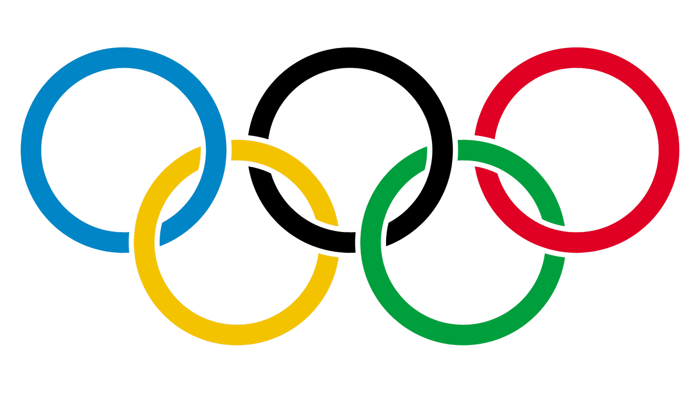

--- 
title: "Storia dei Giochi Olimpici Invernali"
author: "Adriana Angaran"
date: "17 giugno 2024"
documentclass: book
bibliography: [book.bib, packages.bib]
cover-image: images/cover.jpg
description: |
  This is a short illustrated book about the history of the Winter Olympic games from 1924 to 2026.
  The HTML output format for is bookdown::gitbook,
  set in the _output.yml file.
link-citations: yes
github-repo: https://github.com/AdrianaAngaran/Storia-Giochi-Olimpici-Invernali.git_
---

# Introduzione {-}

```{r, echo=FALSE, out.width='70%', fig.cap='I 5 cerchi olimpici'}

```

I Giochi olimpici invernali sono un evento sportivo in cui atleti di ogni nazione gareggiano negli sport invernali, ovvero sport che si svolgono sul ghiaccio o sulla neve.
Sono nati dopo i Giochi olimpici e si disputano dal 1924 ogni quattro anni. Fino al 1992 si disputavano nello stesso anno di quelli estivi, dal 1994 si disputano negli anni pari non divisibili per quattro.

## Nascita {-}
Nel 1894 venne fondato il Comitato Olimpico Internazionale (CIO) e nel 1896 ad Atene venne disputata la prima edizione dei Giochi olimpici dell'era moderna. 
In occasione dei Giochi olimpici di Londra 1908 il pattinaggio di figura venne inserito nel programma olimpico per la prima volta.
Sin dal 1901, prima con cadenza biennale e poi quadriennale, si disputavano in Svezia i **Giochi nordici** sotto la guida del generale *Viktor Balck*, membro del CIO e amico di *Pierre de Coubertin*, "padre" dei Giochi olimpici moderni.

Nel corso della sessione del CIO a Budapest nel 1911, in vista dei Giochi olimpici di Stoccolma dell'anno seguente, il conte italiano *Eugenio Brunetta d'Usseaux* propose di inserire nel programma di gare anche degli sport invernali e quindi di includere l'edizione 1913 dei Giochi nordici nei Giochi della V Olimpiade. Questa proposta venne rigettata dal comitato organizzatore dei Giochi olimpici di Stoccolma e dallo stesso Balck con l'obiettivo di preservare l'indipendenza dei Giochi nordici, così che il 27 maggio 1911 la proposta venne definitivamente respinta.

Nel congresso CIO di Parigi nel giugno 1914 venne ridiscussa l'idea di includere sport invernali nel programma olimpico in vista dei Giochi olimpici di Berlino e venne deciso di aggiungere al programma olimpico il pattinaggio di figura e di velocità, lo sci nordico e l'hockey su ghiaccio. 

Lo scoppio della prima guerra mondiale pochi mesi dopo costrinse all'annullamento dei Giochi della VI Olimpiade.

In occasione dei Giochi della VII Olimpiade di Anversa venne organizzata una settimana dedicata agli sport su ghiaccio dal 23 al 30 aprile 1920, con i tornei olimpici di hockey su ghiaccio e di pattinaggio di figura.

Al congresso del CIO del 1921 si decise che la nazione organizzatrice dell'edizione successiva dei Giochi olimpici, la Francia, avrebbe anche ospitato una distinta **"Settimana internazionale degli sport invernali"**, sotto il patrocinio dello stesso CIO. 
Nel 1922 si tenne un congresso della commissione internazionale dello sci, che portò alla nascita, il 2 febbraio, della Federazione Internazionale Sci (FIS). 

Dal 25 gennaio al 4 febbraio 1924 si tenne la "Settimana internazionale degli sport invernali" a Chamonix-Mont-Blanc, alla quale parteciparono complessivamente 258 atleti in rappresentanza di 16 nazioni, che si cimentarono in 16 gare di 6 diverse discipline. 
Dato il successo della "Settimana internazionale degli sport invernali" il 6 maggio 1926, il CIO decise di istituire i **Giochi olimpici invernali**, da svolgersi ogni quattro anni come i già esistenti Giochi olimpici estivi. 
Nella stessa sessione il CIO decise di designare retroattivamente le gare di Chamonix come I Giochi olimpici invernali, anche su pressione dei Paesi nordici, e di assegnare a Sankt Moritz l'organizzazione della seconda edizione nel 1928.

## Curiosità {-}

I Paesi che hanno ospitato più Olimpiadi invernali:

* Stati Uniti: 4
* Francia: 3 
* Italia: 3 (contando la prossima edizione dei Giochi di Milano-Cortina 2026)
* Austria: 2
* Svizzera: 2
* Norvegia: 2
* Canada: 2
* Giappone: 2

<!--Render book

```{r, eval=FALSE, echo=FALSE}
bookdown::render_book()
```

Preview book

```{r, eval=FALSE}
bookdown::serve_book()
```

Create packages.bib
```{r include=FALSE}
# automatically create a bib database for R packages
knitr::write_bib(c(
  .packages(), 'bookdown', 'knitr', 'rmarkdown'
), 'packages.bib')
```
-->